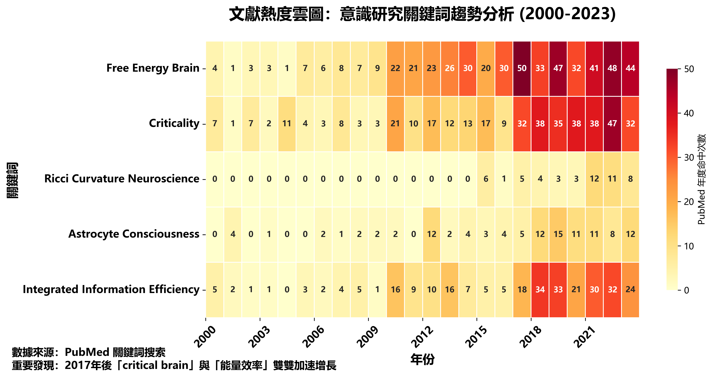

# 01. Introduction: Problem Landscape and Contributions

---
## P ── Why Revisit "Consciousness" Again?

### Five Driving Forces

1. **🔬 Technological Momentum**
   The convergence of BCI, Neuropixels, and generative AI enables previously philosophical propositions to be validated at signal and code levels.
2. **🏥 Clinical Demands**
   Long COVID brain fog, deep coma assessment, DBS/CLS modulation urgently require quantifiable "consciousness scales" to replace sole reliance on behavioral observation.
3. **⚠️ Social Risks**
   Generative AI, synthetic biology, and panopticon surveillance push "whether machines possess/should possess consciousness" to the public policy level.
4. **🧩 Theoretical Fragmentation**
   Free energy, IIT, GNW, critical brain theories and research exist at the frontier; we hope to open possibilities for mutual resonance and integration.
5. **🌐 Open Science Era**
   GitHub, OpenNeuro, OSF make crowdsourced reanalysis a viable pathway.

---
## F ── Overview of Major Theoretical Clusters

### Four Major Theoretical Axes

1. **Predictive Coding & Free Energy**
2. **Critical Synchronization & Self-Organized Criticality** (SOC)
3. **Geometric Topology & Integrated Information** (TDA & IIT)
4. **Energy-Metabolism & Information Efficiency** (Energetics & η)

> 💡 **Insight**: The above four clusters each excel in their domains; we discovered their mutual influences during exploration.

#### Detailed Analysis of Four Theoretical Clusters

1. **Predictive Coding & Free Energy**
   **Core**: The brain aims to minimize free energy *F* of sensory prediction errors as an objective function.
   **Representatives**: Friston (2010); bidirectional Bayesian inference between high-low levels.
   **Strengths**: Connects perception, motor, and learning under unified principles; mappable to brain regional hierarchies.
   **Limitations**: Difficult to correspond to sudden ignition of "reportable consciousness"; free energy challenging to quantify in vivo.

2. **Critical Synchronization & SOC** (Critical Brain Dynamics)
   **Core**: Neural networks self-organize to critical point σ→1, exhibiting spike avalanches and 1/f power laws.
   **Representatives**: Beggs & Plenz (2003); Shew & Plenz (2013).
   **Strengths**: Direct detection of critical indicators using spikes, EEG, MEG; corresponds to information transmission efficiency.
   **Limitations**: Is criticality necessary and sufficient? Clinical deep sleep also shows SOC traces.

3. **Geometric Topology & Integrated Information** (Geometric & Topological Metrics)
   **Core**: Uses invariants like Euler χ, Betti₁, Ricci curvature, Φ to measure "integration-differentiation balance".
   **Representatives**: IIT 3.0 (Tononi, 2014); topological data analysis in MEG (Giusti, 2015).
   **Strengths**: Cross-scale dimensionless; captures complex network reconstruction moments.
   **Limitations**: High computational cost, sensitive to data resolution; in-field Φ estimation remains limited.

4. **Energy-Metabolism & Information Efficiency** (Energetics & Efficiency)
   **Core**: Consciousness states correspond to maximal "information/power" efficiency η or energy consumption thresholds.
   **Representatives**: Attwell & Laughlin (2001); Stender et al. (2016, PET-CMRglc).
   **Strengths**: Direct connection with PET/fMRI metabolic imaging and clinical coma indicators.
   **Limitations**: Precise alignment between macroscopic energy consumption and microscopic information flow remains to be established.

---
## I ── Contributions of This Paper

### 🔑 Core Innovations

* **Propose "Six Keys"** as the least common multiple across theories, demonstrating computability via *Python Notebooks*.
* **Fractal P-F-I-O-R framework** for convenient data supplementation or refutation of the six keys.
* **Unified dynamic window**: Integrating energy efficiency, topological criticality, and astrocytic coupling into the same window, attempting to fill current literature gaps.
* **Critical Tube Manifold (CTM) extension**: Generalizing single-point critical hypersurface $\Sigma_c$ to neutrally stable tube $\pi(\Sigma_{\mathrm{CT}})$, introducing **weighted distance**:

  $$D_w(t) = \sqrt{\sum_{i=1}^{6} w_i \zeta_i^2},\qquad \sum_i w_i = 1$$

  A single metric for measuring "**co-criticality degree**".
  
* **Open-source collaborative workflow**: Adopting 📄 CC BY-NC 4.0 (text) and 💻 BSD 3-Clause (code) licenses.

---
## O ── Literature Heat Map (2000–2023)

### 📊 Research Trend Analysis

###### **Figure 01.1** Literature Heat Map

Analysis of keywords:

* `"free energy brain"`
* `"criticality"`
* `"Ricci curvature neuroscience"`
* `"astrocyte consciousness"`
* `"integrated information efficiency"`

Annual hit counts in **PubMed**.

> 📈 **Key Finding**: After 2017, both "critical brain" and "energy efficiency" show accelerated growth, indicating increased demand for cross-scale integration.

---
## R ── Paper Architecture Navigation

### 📚 Overall Structure

#### Part I Core Volume

1. **Chapter 0**: Abstract
2. **Chapter 1**: Introduction (this chapter)
3. **Chapter 2**: Unified Framework & CTM
4. **Chapters 3-8**: Detailed exposition of six keys
5. **Chapter 9**: Cross-validation, public data reanalysis
6. **Chapter 10**: Six keys with neural manifolds, Bayesian updating
7. **Chapter 11**: Discussion
8. **Chapter 12**: Conclusion

#### Part II Extended Volume

* **Appendices A-F**: Mathematical derivations, code index, symbol tables, literature citations, license terms, etc.

### 🔄 Design Features

* **Single Git repository** management
* **Fractal template** structure
* Readers can **collapse or expand** details at any level

---
## 💡 Chapter Summary

**Consciousness research stands at the convergence of technological, clinical, and social driving forces**; we attempt to propose a verifiable, collapsible, open-source unified indicator set. **The six keys and CTM extension** provide a single quantification window through distance measure $D_w$, laying the theoretical, empirical, and open-source verification foundation for subsequent chapters.

---
**Next Chapter Preview**: Chapter 2 will detail the mathematical foundations of the unified framework and the geometric construction of the Critical Tube Manifold.