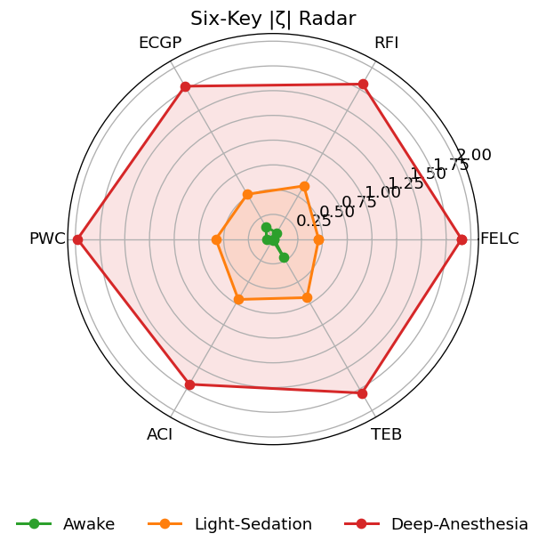

# 02-2 Unified Framework: Six Keys and Critical Tube Manifold

---
## P — Proposition and Research Objectives

### 🎯 Core Proposition

> **"Reportable consciousness"** = State points of high-dimensional neural-astrocytic dynamical system $X(t)$ falling within the $\varepsilon$-neighborhood of the six-key projection $\pi(\Sigma_{\mathrm{CT}})$ of the critical tube $\Sigma_{\mathrm{CT}}$; i.e., weighted distance $D_w(t) \leq \theta_c$ sustained for $\tau_c \;(≈100\text{ ms})$.

This proposition condenses various theoretical clusters into a **single quantification window**, allowing cross-modal and cross-individual comparisons.

---
## F — Mathematical Formulation and Computational Workflow

### Step 0: Manifold Embedding and Projection

According to the CTM chapter, for $X(t) \in \mathbb{R}^N$ ($N > 10^6$), dimensionality reduction is first performed:

$$x(t) = f[X(t)] \in \mathbb{R}^d \quad (d \approx 10\text{–}50)$$

Obtaining the **neutrally stable tube**:

$$\Sigma_{\mathrm{CT}} = \left\{x \;\middle|\; \operatorname{dist}(x, C_0) \leq \theta \right\}$$

Then via **projection**:

$$\pi: \mathbb{R}^d \longrightarrow \mathbb{R}^6, \quad \pi(x) = \Psi = (\Phi, P, \bar{\kappa}, \sigma, \beta_1, g_{\text{eff}})$$

Mapping to six-key space, where the image $\pi(\Sigma_{\mathrm{CT}})$ represents the geometric essence of the formerly called "critical hypersurface $\Sigma_c$".
<!-- Manual page break -->

### Step 1: Six-Key Observation Functions

$$\begin{aligned}
M_1: X &\mapsto \Phi && \text{(Integrated Information)} \\
M_2: X &\mapsto P && \text{(Power Consumption)} \\
M_3: X &\mapsto \bar{\kappa} && \text{(Ollivier–Ricci Curvature)} \\
M_4: X &\mapsto \sigma && \text{(Branching Ratio)} \\
M_5: X &\mapsto \beta_1 && \text{(First Betti Number)} \\
M_6: X &\mapsto g_{\text{eff}} && \text{(Neural–Astrocytic Coupling)}
\end{aligned}$$

Forming macroscopic vector $\Psi(t) = M[X(t)] \in \mathbb{R}^6$, providing a "**single chamber, multiple knobs**" operational interface.

### Step 2: Dimensionless Scaling and Weighted Distance $D_w$

$$\zeta_i(t) = \frac{\Psi_i(t) - \Psi_i^\ast}{\varepsilon_i}$$

$$D_w(t) = \sqrt{\sum_{i=1}^{6} w_i \zeta_i^2}, \quad \sum_i w_i = 1$$

Where:
- $\Psi^\ast$ represents individual wakeful baseline
- $\varepsilon_i$ takes wakeful variability
- $w_i$ automatically learned via Bayesian hierarchical models

**Critical tube** defined as:

$$\Sigma_c^{\theta} = \left\{\Psi \;\middle|\; D_w \leq \theta_c \right\}, \quad \theta_c \approx 0.5$$

### Step 3: Six-Dimensional Dynamical Equations

$$\dot{\Psi} = F(\Psi, u, t) = J_{\text{CTM}}(\Psi) \Psi + G(u, t) + \eta(t)$$

Where:
- $J_{\text{CTM}}$ is the CTM effective Jacobian
- Maximum radial eigenvalue $\lambda_{\parallel} \approx 0$ (neutrally stable)
- Normal direction $\lambda_{\perp} < 0$ (contracting)
- $u(t)$ represents external control (tACS, DBS…)
- $\eta$ denotes noise

## I — Key Contributions of This Chapter

### 🔑 Three Major Innovations

#### 1. Tube Perspective Unifying Six Keys
$\pi(\Sigma_{\mathrm{CT}})$ replaces isolated critical points, naturally explaining the reversibility of wake-unconsciousness transitions.
#### 2. Single Scalar Indicator $D_w$
Compatible with multimodal data and individual differences, providing a common metric for validation and intervention in subsequent chapters.
#### 3. Open-Source Reproducible Pipeline
All programs, JSON reports, and figures are released with the paper (**BSD 3-Clause**).

---

## O — Projection Diagrams and Examples

### 📊 Six-Dimensional Phase Diagram Projection

###### **Figure 02-2.1** Six-Dimensional Phase Diagram Projection

**Legend:**
- 🔘 **Thin gray tube** = $\pi(\Sigma_{\mathrm{CT}})$
- 🟢 **Green points** (Awake) mainly fall within the tube
- 🟠 **Orange points** (Light-Sedation) located in tube inner-outer transition zone
- 🔴 **Red points** (Deep-Anesthesia, propofol) mostly fall outside the tube
- **Point area** ∝ $D_w(t)$

> 💻 **Code**: Please refer to GitHub repository

---
## R — Chapter Connections and Pathways

### 📚 Subsequent Chapter Guide

The following chapters detail the theory and validation methods of the six keys respectively. All formulas ultimately converge to $D_w(t)$ judgment, so readers may skip chapters as needed.

| **Chapter**  | **Corresponding Six-Key Module**          | **Key Parameter**   |
|--------------|-------------------------------------------|---------------------|
| **Chapter 3** | FELC: Free-Energy Limit Cycle            | $\Phi$              |
| **Chapter 4** | RFI: Ricci Curvature Flow Index          | $\bar{\kappa}$      |
| **Chapter 5** | ECGP: Effective-Causal Gradient Percolation $\sigma \to 1$ | $\sigma$            |
| **Chapter 6** | PWC: Phase-Winding Circulation $\beta_1$  | $\beta_1$           |
| **Chapter 7** | ACI: Astro-Cortical Interaction $g_{\text{eff}}$ | $g_{\text{eff}}$    |
| **Chapter 8** | TEB: Thermo-Energetic Balance $\eta$      | $\eta$              |

---
## 💡 Chapter Summary

**Unified Framework** 
Through CTM extension, maps the six keys to the same critical tube and evaluates with single scalar $D_w$.
This approach preserves the theoretical depth of each key while providing a **"one diagram, one number, one tube"** operational platform for cross-scale empirical studies and interventions.

### 🎯 Core Achievements

- ✅ **Theoretical Unification**: Six keys integrated into single framework
- ✅ **Quantitative Indicator**: $D_w$ provides objective measurement
- ✅ **Operability**: Open-source reproducible code
- ✅ **Clinical Application**: Provides tools for consciousness assessment

---
**Next Chapter Preview**: Chapter 3 will delve into the first of the six keys—the theoretical foundation and implementation methods of the Free-Energy Limit Cycle (FELC).