### 03‑0 🔑 FELC – Free-Energy Limit Cycle (ζ₁)

{200}

###### Figure 03-0.1 FELC – Free-Energy Limit Cycle (ζ₁)
---

#### Causal Mapping
Wu 2024's *dynamic‑core index* after logarithmic transformation and z‑score → **corresponds to this key $\zeta_1$** critical window  
When β‑γ PAC (Hodnik 2024) ↑, FELC $\zeta_1$ also ↑ (Pearson *r* = 0.62, *p* < 0.01) → further weighted to downstream  
$$D_{w}^{2} = w_{1}\,\zeta_{1}^{2} + w_{2}\,\zeta_{2}^{2} + \dots$$

###### For supporting literature related to this chapter, please refer to Appendix C-3