### Figure 4‑0 🔑 RFI – Ricci Curvature Critical Flow (ζ₃)

{180}
###### **Figure 04-0.1 RFI – Ricci Curvature Critical Flow (ζ₃)
#### Causal Mapping
When $|\bar{\kappa}(t)| \le \kappa_c = 0.02$ persists for $\tau_c \approx 100\,\mathrm{ms}$ → **$C_{\text{RFI}} = 1$**, the average curvature mapping is:
$$
\zeta_3 = \frac{\bar{\kappa} - \bar{\kappa}^*}{\varepsilon_3}
$$
and weighted to $D_w^2$ through $w_3 = 0.22$.  
Negative curvature sharp decline (e.g., propofol) causes $\zeta_3$ to surge → $D_w \uparrow$ → **geometric escape within 20–30 ms after FELC collapse**, with sequence matching experimental observations.
##### Key Formulas
$$
C_{\text{RFI}} =
\begin{cases}
1, & \text{if } |\bar{\kappa}(t)| \le \kappa_c \text{ for } t \in [t_0, t_0 + \tau_c] \\
0, & \text{otherwise}
\end{cases}
$$
$$
D_{w}^{2} = w_{1}\,\zeta_{1}^{2} + w_{3}\,\zeta_{3}^{2} + \sum_{i \neq 1,3} w_i\,\zeta_{i}^{2}
$$