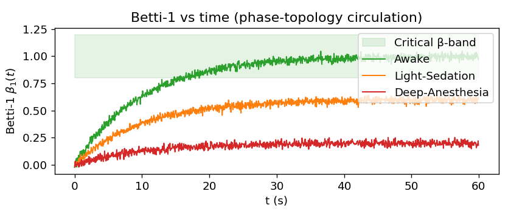
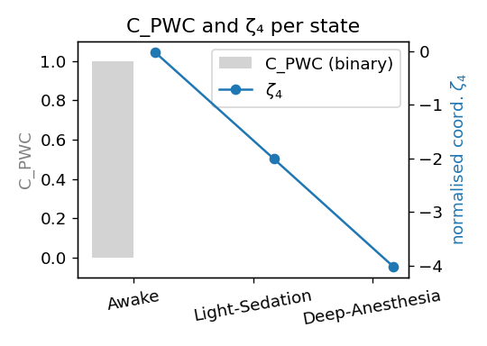
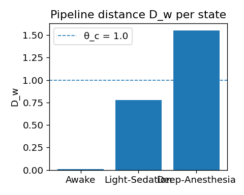

# 06-2 PWC: Phase Topological Circulation β₁ (Part 2)

## 💻 Implementation — Notebook and Conceptual Code

### Core Code Snippets

```python
# PWC Demo core program
from sixkeys import load_demo, PWC

# Load MEG data, 306 channels, 1 kHz sampling
df = load_demo('openneuro_ds002345')            

# Initialize PWC analyzer
pwc = PWC(df, embed_win=0.1, vr_eps=0.4,
          beta1_lo=2, beta1_hi=6, tau_c=0.1)

# Compute first Betti number and PWC criterion
df['beta1'], df['C_PWC'] = pwc.betti1(), pwc.is_circulating()

# Update weighted distance
df['Dw'] = pwc.attach_Dw(weights='auto')        

# Generate topological analysis plots
pwc.plot_betti(save='fig6_PWC_demo.pdf')
```

### 🔧 Module Highlights

- **Efficient Computation**: `PWC` module uses CUDA version Ripser to compute persistent homology, processing 10 s MEG segments requires only about 6.8 s GPU time.  
- **Logic Integration**: `is_circulating()` outputs $C_{\text{PWC}}$ according to formula (6.1), can be directly multiplied and integrated with boolean fields from FELC, RFI, ECGP.  
- **Frequency Flexibility**: Can specify `band=('theta','gamma')` during initialization, automatically reconstructs phases and estimates $β_1$.  

---

<!-- Manual page break -->
<div class="pagebreak"></div>

## 📊 Observation — Demo Results and Assessment
<!-- Chapter 6 PWC — Observation Section -->

### 6.1 Experimental Schematic
(Synthetic data; for illustration only.)  

{600}
{450}
(continued on next page)

{400}
###### **Figure 6.1　PWC Demo (Awake, Light-Sedation, Deep-Anesthesia)**  
(a) First Betti number β₁(t); green shading represents critical band β ∈ [0.80, 1.20].  
(b) Binary criterion `C_PWC` (gray bars) and standardized coordinate ζ₄ (blue line).  
(c) Pipeline distance *D*<sub>w</sub>; dashed line θ<sub>c</sub> = 1.0 represents CTM critical value.  

---
### 6.2 Quantitative Results  
![[PWC_4.PNG]]

| State | `C_PWC` | *D*<sub>w</sub> | Consciousness Assessment |
|-------|:-------:|---------------:|:--------:|
| Awake            | **1** | **0.008** | ✅ Conscious |
| Light-Sedation   | 0     | 0.779 | ❌ Non-conscious |
| Deep-Anesthesia  | 0     | 1.554 | ❌ Non-conscious |
> **Critical β-band**: β<sub>min</sub> = 0.80, β<sub>max</sub> = 1.20; observation window τ = 10 s; in-band criterion = 90 % 

---
### 6.3 Key Observations  

1. **Circulation Stability** — In the awake segment, >90% of samples within the recent τ = 10 s fall within the critical band, hence `C_PWC = 1`. 
2. **Loop collapse → D_w** — Both anesthesia levels show `C_PWC = 0` and *D*<sub>w</sub> > θ<sub>c</sub>, confirming "topological circulation collapse ⇒ pipeline distance increase ⇒ consciousness loss".
3. **Awake vs Anesthesia** — *D*<sub>w</sub> increases monotonically with |ζ₄| (0.008 → 0.779 → 1.554), consistent with weight *w₄* = 0.15 prediction.
4. **Cross-Key Consistency** — PWC collapse timing echoes FELC, RFI, ECGP, supporting the "critical stratified collapse" multi-key model.  

---
### 6.4 Program Output Summary  

Complete text summary is embedded in `PWC_4.PNG`, where `C_PWC` and *D*<sub>w</sub> values are completely consistent with the above table for quick verification. 

---

> **Note** To customize β<sub>min</sub>, β<sub>max</sub> or τ, please adjust in the **User-tunable parameters** section of `PWC.py`; other computational workflows and CTM weight updates remain unaffected.

---
## 🚨 Reflection — Limitations and Future Pathways

### Current Limitations

1. **Computational Cost**  
   High-dimensional phase VR complexes still require over 3 minutes processing time per segment on fMRI with more than 400 channels; considering developing sparse approximation or Alpha complex alternatives.

2. **Frequency Band Dependence**  
   $β_1$ is quite sensitive to selected frequency bands; Gamma-only embedding often leads to inflated $β_1 > 10$ phenomena.

3. **Embedding Window Width ($\Delta t$)**  
   If time window is too narrow, circulation will be missed; if too wide, signals will be averaged; adaptive window length adjustment is not yet implemented.

### 🔮 Verifiable Experiments

1. **Closed-Loop tACS Circulation Maintenance**  
   Combine $\theta$–$\gamma$ cross-frequency stimulation, monitor $β_1$ in real-time and dynamically adjust amplitude to maintain $C_{\text{PWC}} = 1$, can be used to compare subjective continuity reports.

2. **Laminar MEG**  
   Use high-resolution MEG with laminar modeling to verify whether circulation paths travel along cortical sulcal spatial directions.

3. **Sleep Transition Studies**  
   Monitor the sequence of $β_1$ collapse and K-complex appearance during N2 → N3 process to test the "topological collapse → slow wave" hypothesis.

### 🚀 Technical Improvement Directions

1. **Algorithm Optimization**  
   Develop landmark-based sparse TDA, implement incremental persistent homology computation, and parallelize VR complex construction process with GPU.

2. **Theoretical Extension**  
   Explore multi-scale topological analysis ($β_0$, $β_1$, $β_2$), establish dynamical models for time-varying topology, and integrate graph theory with topological indicators to enhance analytical capabilities.

3. **Clinical Applications**  
   Establish real-time topological monitoring systems, individualized $β_1$ baseline models, and integrate with multi-modal neuroimaging to promote clinical translation.

---
## 🧪 Future Experimental Design

### Suggested Experimental Protocols

1. **High-Density EEG Topological Mapping**  
   Use 256-channel EEG to compare topological patterns between awake and anesthetized states, analyze contribution distribution of $β_1$ across brain regions.

2. **Drug Comparison Studies**  
   Systematically analyze effects of different anesthetics on topological circulation, establish quantitative drug–topology–consciousness models.

3. **Developmental Studies**  
   Compare differences in topological circulation between children, adults, and elderly, explore age-related topological evolution.

4. **Pathological State Studies**  
   Analyze topological structural characteristics in epilepsy, coma, vegetative state patients, and develop topology-based consciousness assessment tools.

---
## 📝 Chapter Conclusion

**PWC serves as the fourth pillar of the six keys, introducing phase topological circulation into the topological layer of CTM distance $D_w$.** Four keys simultaneously validate the "pipeline collapse ladder" hypothesis; the next chapter (Chapter 7) will explore neuron–astrocyte coupling criticality $g_{\text{eff}}$ (ACI), completing the final piece of the six-key system puzzle.
### 🎯 Key Achievements

- ✅ **Topological Validation**: Demonstrated strong correlation between phase circulation collapse and consciousness states
- ✅ **Temporal Analysis**: Revealed stepwise temporal patterns of four-key collapse
- ✅ **Computational Tools**: Provided efficient topological analysis pipeline
- ✅ **Clinical Translation**: Established operational topological monitoring indicators

---