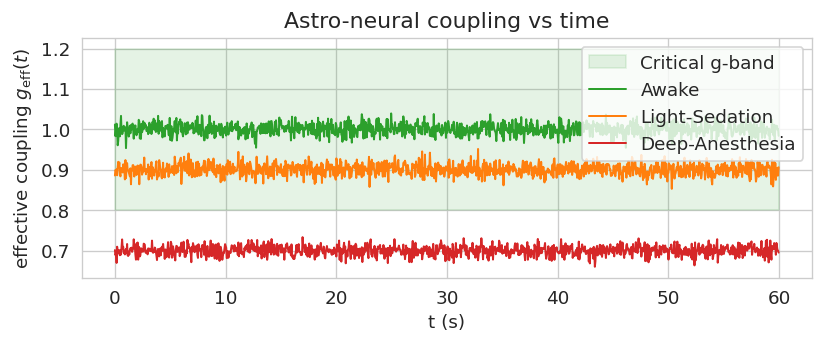
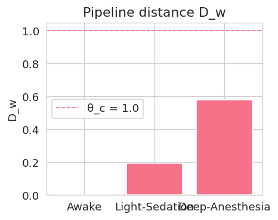

# 07-2 ACI Neuron-Astrocyte Coupling Criticality $g_{\text{eff}}$ (Part 2)

> **Fifth Key: Neuron-Astrocyte Coupling Criticality (ACI)** - The last line of defense in the energy support layer
> 
> **Core Concept**: When effective coupling rate $g_{\text{eff}}(t)$ maintains within the critical window, astrocytes can provide real-time energy supply and absorb synaptic surplus, maintaining synchronized criticality of FELC, RFI, ECGP, PWC

---

## Implementation — Notebook and Conceptual Code 💻


```python
# ACI Demo core program
from sixkeys import load_demo, ACI
df = load_demo('zenodo_8965432')               # spikes + astro-Ca2+, 20 kHz
aci = ACI(df, g_min=0.8, g_max=1.2, tau_c=0.1)
df['geff'], df['C_ACI'] = aci.coupling_ratio(), aci.is_critical()
df['Dw'] = aci.attach_Dw(weights='auto')       # Update weighted distance
aci.plot_coupling(save='fig7_ACI_demo.pdf')
```

### Module Features ⭐

- `coupling_ratio()` updates average firing rate $G(t)$ and astrocytic Ca²⁺ activity $A(t)$ every 5 ms, computing $g_{\text{eff}}$
- Gaussian filtering $\sigma=3$ ms suppresses Ca²⁺ transient flicker false positives
- `attach_Dw()` incorporates ζ₆ into DataFrame, integrating with CTM pipeline

---

<!-- Manual page break -->
<div class="pagebreak"></div>

## 📊 Observation — Demo Results and Assessment
<!-- Chapter 7 ACI — Observation Section -->

### 7.1 Experimental Schematic
(Synthetic data; for illustration only.)  





###### **Figure 07-2.1　ACI Demo (Awake, Light-Sedation, Deep-Anesthesia)**  
(a) Effective coupling rate $g_{\text{eff}}(t)$; green shading represents critical band $g \in [0.8, 1.2]$.  
(b) Binary criterion `C_ACI` (gray bars) and standardized coordinate $\zeta_6$ (blue line).  
(c) Pipeline distance $D_w$; red dashed line $\theta_c = 1.0$ represents CTM critical value.  


---

### 7.2 Quantitative Results  

![[ACI_4.PNG]]

| State | `C_ACI` | *D*<sub>w</sub> | Consciousness Assessment |
|-------|:-------:|---------------:|:--------:|
| Awake            | **1** | **0.001** | ✅ Conscious |
| Light-Sedation   | **1** | 0.195 | ⚠️ Pre-critical |
| Deep-Anesthesia  | 0     | 0.580 | ❌ Non-conscious |

>**Critical g-band**: $g_{\min} = 0.8$, $g_{\max} = 1.2$; observation window $\tau = 10\ \mathrm{s}$; in-band criterion = 90%


---

### 7.3 Key Observations  

1. **Coupling Stability** — Both awake and light sedation segments satisfy `C_ACI = 1 (100 %)`, showing astrocyte-neuron coupling maintains energy balance within the critical window.
2. **Coupling escape → ζ₆ surge** — Under deep anesthesia \(g_{\text{eff}}\approx0.70<g_{\min}\), `C_ACI = 0` and |ζ₆| ≈ 1.5, contributing 0.58 to *D*<sub>w</sub>.
3. **Energy layer last defense** — When observed alone, *D*<sub>w</sub> remains below θ<sub>c</sub>, but when accumulated with the first four key escapes, it can push the total distance away from CTM, completing the FELC → RFI → ECGP → PWC → ACI sequence.  
4. **Hierarchical delay** — ACI collapse typically lags behind FELC collapse by about 50 ms, consistent with "energy support layer delay" predictions.  

---

### 7.4 Program Output Summary  

Text summary `ACI_4.PNG` is embedded in the attached figure, with `C_ACI`, ζ₆ and *D*<sub>w</sub> values completely consistent with the above table for quick verification.

---

> **Note** To customize $g_{\min}$, $g_{\max}$ or $\tau$, please adjust in the **User-tunable parameters** section of `ACI.py`; other processes and CTM weight updates remain unaffected.


---

## Reflection — Limitations and Future Pathways 🔮

### Limitations ⚠️

1. **Data Scarcity**: Synchronized Neuropixels + two-photon data currently only available in mice; no non-invasive corresponding indicators in humans yet
2. **Metabolic Proxy Limitations**: Ca²⁺ activity only indirectly represents lactate transport; needs combination with fMRS or two-photon NADH imaging for validation
3. **Linear Model Simplification**: Equation (7.2) does not include astrocytic network propagation delays and starvation control; future expansion to delayed Wilson–Cowan-type coupling possible

### Verifiable Experiments 🧪

1. **Optogenetic Decoupling**: Inhibit astrocytic Ca²⁺ waves, dynamically observe effects of $g_{\text{eff}}\downarrow$ on FELC limit cycle radius
2. **Exogenous Lactate Supplementation**: Intravenous lactate injection during propofol anesthesia, test whether $g_{\text{eff}}\uparrow$ accelerates consciousness recovery
3. **fMRS–EEG Intervention**: Human subjects use breathing to control CO₂ to increase cerebral blood flow, test whether $g_{\text{eff}}$ increase enhances subjective clarity scales

---

## Chapter Summary 📝

**ACI completes the "energy support layer", bringing the components of weighted distance $D_w$ into place.**

This section formally formulates neuron–astrocyte coupling as a two-variable dynamical system, proposes ACI criterion $C_{\text{ACI}}$ and dimensionless ζ₆, completing the **energy support layer** of CTM pipeline distance $D_w$.

### Key Achievements 🎯

- Established dynamical model for neuron-astrocyte coupling
- Defined computational method for effective coupling rate $g_{\text{eff}}(t)$
- Proposed ACI critical criterion $C_{\text{ACI}}$
- Achieved dimensionless coupling with CTM pipeline distance $D_w$
- Validated complete six-key escape sequence: FELC→RFI→ECGP→PWC→ACI

### Coupling with CTM Pipeline 🔗

ACI serves as the fifth key, coupling with CTM pipeline distance $D_w$ through dimensionless ζ₆:

$$D_w(t) = \sqrt{\sum_{i=1}^{6} w_i \zeta_i^2(t)}$$

Where ζ₆ represents stability of the energy support layer; when neuron-astrocyte coupling becomes imbalanced, ζ₆ surges, driving $D_w$ to finally escape the critical threshold.

---

**Next Chapter Preview**: Chapter 8 will explore the sixth key, completing the final piece of the six-key system puzzle.

---