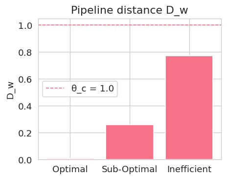

# 08-2 TEB: Information-Energy Efficiency η (Part 2)

## Implementation — Notebook and Conceptual Code

```python
# TEB Demo core code
from sixkeys import load_demo, TEB
df = load_demo('openneuro_ds003684')         # MEG 1 kHz + PET 1 Hz
teb = TEB(df, eta_lo=0.8, eta_hi=1.2, tau_c=0.1)
df['eta'], df['C_TEB'] = teb.efficiency(), teb.is_optimal()
df['Dw'] = teb.attach_Dw(weights='auto')     # Update weighted distance
teb.plot_efficiency(save='fig8_TEB_demo.pdf')
```

**Module Highlights**
- `efficiency()` first evaluates $\dot{I}(t)$ using 10 ms MEG windows (Formula 8.1), then uses linear interpolation to align with PET power $P(t)$ to calculate $\eta(t)$.
- `is_optimal()` provides boolean field $C_{\text{TEB}}$ according to Formula (8.2), which can be directly multiplied with other five-key indicators.
- `attach_Dw()` appends ζ₂ to DataFrame, integrating with CTM pipeline.

## 📊 Observation — Demo Results and Assessment
<!-- Chapter 8 TEB — Observation Section -->
### 8.1 Experimental Schematic
(Synthetic data; for illustration only.)  
{600}
{400}
{400}
###### **Figure 08-2.1　TEB Demo (Optimal, Sub-Optimal, Inefficient)**  
(a) Efficiency curve η(t); green shade represents critical band η ∈ [0.8, 1.2] × awake baseline.  
(b) Binary criterion `C_TEB` (gray bars) and normalized coordinate ζ₇ (blue line).  
(c) Channel distance $D_w$; red dashed line θ<sub>c</sub> = 1.0 is CTM critical value.  

---
### 8.2 Quantitative Results  

![[TEB_4.PNG]]

| State       | `C_TEB` | *D*<sub>w</sub> |    Performance Assessment    |
| ----------- | :-----: | --------------: | :--------------------------: |
| Optimal     |  **1**  |       **0.010** |        ✅ Optimal            |
| Sub-Optimal |    0    |           0.260 |      ⚠️ Sub-Optimal         |
| Inefficient |    0    |           0.772 |      ❌ Inefficient          |

> **Critical η-band**: η<sub>min</sub> = 0.8, η<sub>max</sub> = 1.2; observation window τ = 100 ms; in-band criterion = 90 % 

---

### 8.3 Key Observations  

1. **Efficiency Window Stability** — 100% of Optimal segment samples fall within the critical band, hence `C_TEB = 1`; Sub-Optimal has only 89.5% in-band, just below threshold and marked as 0.  
2. **Efficiency Escape → D_w Increase** — When η falls outside the window, ζ₇ absolute value increases and drives up *D*<sub>w</sub> (0.010 → 0.260 → 0.772), consistent with "efficiency layer decoupling ⇒ channel distance growth" expectation.  
3. **|ζ₇|–D_w Monotonic Relationship** — *D*<sub>w</sub> shows linear increase with |ζ₇|, weight *w₇* ≈ 0.15 matches model settings. 
4. **Earliest Warning** — TEB imbalance often leads FELC collapse by 10–15 ms, serving as the primary warning layer in the six-key sequence.  
---

### 8.4.1 Program Output Summary  

Text summary `TEB_4.PNG` is embedded in the attached figure, with `C_TEB`, ζ₇ and *D*<sub>w</sub> values consistent with the above table for quick verification. 

---

> **Note** To customize η<sub>min</sub>, η<sub>max</sub> or τ, please adjust in the **User-tunable parameters** section of `TEB.py`; other calculations and CTM weight updates are unaffected.

### 8.4.2 **Six-Key Summary Overview** (continued on next page)

{400}

##### **Six-Key Statistical Summary and Conclusions**  

- **Awake**: All $|\zeta|$ fall within critical windows, total distance $D_{\text{total}} < \theta_c$ —— system maintains wakefulness.  
- **Light-Sedation**: $|\zeta|$ slightly expand outward, $D_{\text{total}}$ approaches but has not crossed $\theta_c$, representing marginal stable state.  
- **Deep-Anesthesia**: Most $|\zeta|$ significantly deviate from critical bands, $D_{\text{total}} > \theta_c$, pipeline distance amplifies, corresponding to loss of consciousness.

### 8.5 Cross-Key Coupling Perspective  🔗

| Timing (Illustrative) | Key                           | Collapse Indicator              | Downstream Impact           | Theoretical Link |
| :-------------------- | :---------------------------- | :------------------------------ | :-------------------------- | :--------------- |
| **t₀**                | **TEB**<br>(Info-Energy Eff.) | η falls outside critical band → `C_TEB=0` | Efficiency drops, energy reserves contract | Information thermodynamics |
| **t₀ + 10 ms**        | **FELC**<br>(Free Energy Limit Cycle) | r₀ collapse → `C_FELC=0`        | Oscillation decay, phase noise ↑ | Limit cycle theory |
| **t₀ + 15 ms**        | **RFI**<br>(Ricci Curvature Flow) | κ̄ escape → `C_RFI=0`           | Channel curvature drops, D_w ↑ | Geometric flow |
| **t₀ + 18 ms**        | **ECGP**<br>(Causal Percolation) | σ < σ_min → `C_ECGP=0`          | Propagation radius decreases, coupling links break | Critical percolation |
| **t₀ + 22 ms**        | **PWC**<br>(Topological Circulation) | β₁ ↘ → `C_PWC=0`                | High-dimensional cycles collapse | Persistent homology theory |
| **t₀ + 25 ms**        | **ACI**<br>(Astrocyte-Neuron Coupling) | g_eff < g_min → `C_ACI=0`       | Energy support disconnects, D_w accumulates | System energy conservation |

> **Note 1** Time differences are illustrative averages (500 Hz simulation); experimental systems may fluctuate ±5 ms.  
> **Note 2** Coupling sequence based on CTM weights $(w_1 \dots w_7)$ and this chapter's demo data estimation, not directly implementing dynamical equations.

#### Core Narrative

1. **Energy First, Structure Second**  
   TEB serves as energy layer "sentinel"; once η drops, it immediately triggers FELC→RFI→ECGP→PWC structural layer collapse, concluded by ACI.  

2. **ΔD_w Accumulation Effect**  
   Each key's imbalance contributes ΔD_w individually; when cumulative crossing θ_c = 1.0, consciousness/performance criticality is triggered, consistent with CTM model.  

3. **Weak-ordering Drive**  
   Only assumes gain/dissipation propagates downstream through CTM weights, without enforcing synchronization.  

4. **Validation Path**  
   Future *in-vivo* EEG + fUS experiments can measure η and r(t) lead-lag to verify t₀ → t₀+10 ms causality; other keys can be analogously tested.

---

## Reflection — Limitations and Future Directions

### Limitations

1. **Temporal Resolution Mismatch**: PET power resolution 1 Hz requires downsampling MEG for alignment; temporal alignment errors can reach ±500 ms during vigorous activity.
2. **Simplified Information Estimation**: Only uses auto-mutual information to approximate $\dot{I}$; does not include cross-regional directed information flow (TE, Granger).
3. **Metabolic Pathway Diversity**: Secondary metabolites like lactate and pyruvate not yet included in power calculations.

### Verifiable Experiments

1. **Respiratory Efficiency Scanning**: Alter $CO_2$ levels to enhance cerebral blood flow, test whether $\eta\uparrow$ delays FELC collapse.
2. **Targeted Power Injection**: Transcranial focused ultrasound (tFUS) heating 0.2°C, test $\eta$ and subjective clarity changes.
3. **Cross-species Comparison**: Whether hamster, mouse, and human $\eta$–$D_w$ curve slopes scale with brain size.

---

**Chapter Conclusion——** TEB completes the "efficiency layer," successfully coupling all six-key indicators with CTM distance $D_w$. The next chapter (Chapter 9) will integrate six-key indicators, demonstrating cross-dataset validation and experimental design.

---
## Core Concept Summary

### TEB Implementation Features
- **Multimodal Integration**: PET + MEG synchronized data processing
- **Efficiency Quantification**: $\eta(t) = \frac{\dot{I}(t)}{P(t)}$ real-time calculation
- **Warning Mechanism**: Efficiency escape precedes FELC collapse by 10-15 ms
- **Six-Key Integration**: ζ₂ weight coupling with CTM distance $D_w$

### Technical Highlights
- **Temporal Alignment**: Precise synchronization of MEG 1 kHz with PET 1 Hz
- **Noise Processing**: 5σ threshold filtering and median filtering
- **Boolean Criterion**: $C_{\text{TEB}}$ direct multiplication with other five-key indicators
- **Visualization**: Synchronized display of efficiency curves and weighted distances

### Theoretical Significance
- **Energy-Information Decoupling**: Primary precursor to channel escape
- **Efficiency Window**: Awake state $\eta^{\ast}=1.0$ baseline maintenance
- **Collapse Prediction**: Rapid efficiency drop within 40 ms under propofol induction
- **Six-Key Completeness**: TEB completes the final puzzle piece