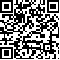

# Appendix F　Complete Licensing Terms

This project is divided into two main parts: "**Text/Figures**" and "**Code/Scripts**", which are respectively subject to:
- **Creative Commons Attribution–NonCommercial 4.0 International (CC BY-NC 4.0)** — Paper text, figures, supplementary explanations.
- **BSD 3-Clause License** — All `.py / .ipynb / .sh` and other program and script files in the GitHub repository.
The following is the complete official text (downloaded 2025-04-30), with only formatting and page numbers added for reading convenience; any non-original notes are marked with gray background "**Note**".

(Continued on next page)

<!-- Manual page break -->
<div class="pagebreak"></div>

## F.1　Creative Commons BY-NC 4.0
###### Complete official terms, not detailed here, please refer to the official website.

```
Creative Commons Attribution-NonCommercial 4.0 International
===========================================================
By exercising the Licensed Rights (defined below), You accept and agree to be
bound by the terms and conditions of this Creative Commons Attribution-
NonCommercial 4.0 International Public License ("Public License"). To the
extent this Public License may be interpreted as a contract, You are granted
the Licensed Rights in consideration of Your acceptance of these terms and
conditions, and the Licensor grants You such rights in consideration of
benefit the Licensor receives from making the Licensed Material available
under these terms and conditions.
Section 1 – Definitions.
...
Section 2 – Scope.
...
Section 3 – License Conditions.
...
Section 4 – Sui Generis Database Rights.
...
Section 5 – Disclaimer of Warranties and Limitation of Liability.
...
```
## F.2　BSD 3-Clause License

(Continued on next page)

```
BSD 3-Clause License
--------------------

Copyright (c) 2025, Hou, You-Yang and contributors
All rights reserved.

Redistribution and use in source and binary forms, with or without
modification, are permitted provided that the following conditions are met:

1. Redistributions of source code must retain the above copyright notice,
   this list of conditions and the following disclaimer.

2. Redistributions in binary form must reproduce the above copyright notice,
   this list of conditions and the following disclaimer in the documentation
   and/or other materials provided with the distribution.

3. Neither the name of the project nor the names of its contributors may be
   used to endorse or promote products derived from this software without
   specific prior written permission.

THIS SOFTWARE IS PROVIDED BY THE COPYRIGHT HOLDERS AND CONTRIBUTORS "AS IS"
AND ANY EXPRESS OR IMPLIED WARRANTIES, INCLUDING, BUT NOT LIMITED TO, THE
IMPLIED WARRANTIES OF MERCHANTABILITY AND FITNESS FOR A PARTICULAR PURPOSE ARE
DISCLAIMED. IN NO EVENT SHALL THE COPYRIGHT HOLDER OR CONTRIBUTORS BE LIABLE
FOR ANY DIRECT, INDIRECT, INCIDENTAL, SPECIAL, EXEMPLARY, OR CONSEQUENTIAL
DAMAGES (INCLUDING, BUT NOT LIMITED TO, PROCUREMENT OF SUBSTITUTE GOODS OR
SERVICES; LOSS OF USE, DATA, OR PROFITS; OR BUSINESS INTERRUPTION) HOWEVER
CAUSED AND ON ANY THEORY OF LIABILITY, WHETHER IN CONTRACT, STRICT LIABILITY,
OR TORT (INCLUDING NEGLIGENCE OR OTHERWISE) ARISING IN ANY WAY OUT OF THE USE
OF THIS SOFTWARE, EVEN IF ADVISED OF THE POSSIBILITY OF SUCH DAMAGE.
```
## F.3　Usage Instructions and Notes

- **Academic Citation**: When citing any paragraph or figure from this text, please cite the author and year according to journal format and attach the CC BY-NC 4.0 link.
- **Non-commercial Restriction**: Any commercial nature (profit-making, paid courses, patent applications, etc.) requires written consent.
- **Code Redistribution**: When modifying or redistributing the code, please retain the BSD 3-Clause terms in `LICENSE` and update the "copyright".
- **Derivative Works**: Strongly recommend releasing derivative Notebooks or datasets under the same or more permissive open-source terms to promote scientific accumulation.

---
## Detailed Licensing Terms

### Creative Commons BY-NC 4.0 Key Points

#### Permitted Uses
- **Share**: Copy and redistribute the material in any medium or format
- **Adapt**: Remix, transform, and build upon the material
- **Academic Research**: Use for non-profit educational and research purposes
- **Citation Analysis**: Cite and discuss in academic papers

#### Usage Conditions
- **Attribution**: Must give appropriate credit, provide a link to the license, and indicate if changes were made
- **NonCommercial**: May not use the material for commercial purposes or primarily for commercial advantage

### BSD 3-Clause License Key Points

#### Permitted Uses
- **Commercial Use**: May be used for commercial purposes
- **Modification**: May modify the source code
- **Distribution**: May distribute source code and compiled versions
- **Private Use**: May use privately without disclosure

#### Usage Conditions
- **Retain Copyright Notice**: Must retain the original copyright notice
- **Retain License Terms**: Must retain the complete BSD license terms
- **Disclaimer**: Must include disclaimer
- **No Endorsement**: May not use original author's name for endorsement

### Advantages of Dual Licensing

1. **Academic Freedom**: Researchers can freely use text content for academic research
2. **Technical Innovation**: Developers can commercialize applications based on the code
3. **Knowledge Protection**: Prevents purely commercial content plagiarism
4. **Community Development**: Promotes healthy development of open-source communities

---

For complete, latest terms, please refer to:
- [Creative Commons BY-NC 4.0](https://creativecommons.org/licenses/by-nc/4.0/)
- [BSD 3-Clause License](https://opensource.org/licenses/BSD-3-Clause)

---

**Author:** You Yang Hou  
**Email:** [isyanghou@gmail.com](mailto:isyanghou@gmail.com)   
[](https://orcid.org/0009-0000-7041-8574) [0009-0000-7041-8574](https://orcid.org/0009-0000-7041-8574)
**Date:** 2025-06-28
**Open Source Repository:** [https://github.com/isyanghou/6Keys](https://github.com/isyanghou/6Keys)

{60}

---

*May transparency, sharing, and mutual trust promote co-creation and validation in the critical neuroscience community.*