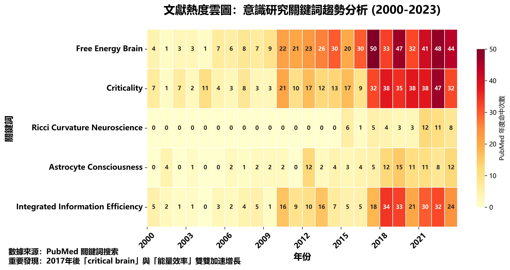

# 01.　緒論：問題景觀與貢獻

---
## P ── 為何再談「意識」？

### 五大驅動力

1. **🔬 技術推力**
   BCI、Neuropixels、生成式 AI 的並進，使原屬哲學命題者得以落到訊號層與代碼層驗證。
2. **🏥 臨床需求**
   長新冠腦霧、深度昏迷評估、DBS/CLS 調控，急需可量化的「意識刻度」取代單靠行為觀察。
3. **⚠️ 社會風險**
   生成式 AI、合成生物、全景監控將「機器是否具／應具意識」推向公共政策層面。
4. **🧩 理論碎片化**
   自由能、IIT、GNW、臨界腦等理論與研究處於前沿領域，我們希望打開彼此呼應整合的可能性。
5. **🌐 開放科學時代**
   GitHub、OpenNeuro、OSF 讓眾包重分析成可行路徑。

---
## F ── 主要理論簇概覽

### 四大理論軸心

1. **預測編碼／自由能** (Predictive Coding & Free Energy)
2. **臨界同步／自組臨界** (SOC)
3. **幾何拓撲／整合訊息** (TDA & IIT)
4. **能量‑代謝／資訊效率** (Energetics & η)

> 💡 **洞察**：上述四簇各擅其長，我們在探索過程中發現他們彼此影響。

#### 四大理論簇詳解

1. **預測編碼 / 自由能**（Predictive Coding & Free Energy）
   **核心**：腦以最小化感官預測誤差的自由能 *F* 為目標函數。
   **代表**：Friston (2010)；高層–低層雙向貝葉斯推理。
   **強項**：連結感知、運動、學習於同一原理；可映射腦區階層。
   **侷限**：難對應「報告式意識」的突然點火；自由能難以實地量化。

2. **臨界同步 / SOC**（Critical Brain Dynamics）
   **核心**：神經網絡自組織到臨界點 σ→1，呈尖峰雪崩與 1/f 幂率。
   **代表**：Beggs & Plenz (2003)；Shew & Plenz (2013)。
   **強項**：可用尖峰、EEG、MEG 直接偵測臨界指標；與資訊傳遞效率對應。
   **侷限**：臨界是否必要且充分？臨床深睡亦見 SOC 痕跡。

3. **幾何拓撲 / 整合訊息**（Geometric & Topological Metrics）
   **核心**：以 Euler χ、Betti₁、Ricci 曲率、Φ 等不變量衡量「整合‑分化平衡」。
   **代表**：IIT 3.0 (Tononi, 2014)；topological data analysis in MEG (Giusti, 2015)。
   **強項**：跨尺度無量綱；可捕捉複雜網絡重構瞬間。
   **侷限**：計算成本高、對資料解析度敏感；Φ 的現場估測仍受限。

4. **能量‑代謝 / 資訊效率**（Energetics & Efficiency）
   **核心**：意識狀態對應「資訊/功率」效率 η 的極大或能耗門檻。
   **代表**：Attwell & Laughlin (2001)；Stender et al. (2016, PET‑CMRglc)。
   **強項**：與 PET/fMRI 代謝影像與臨床昏迷指標直接連動。
   **侷限**：宏觀能耗與微觀資訊流的精確對位尚待確立。

---
## I ── 本稿貢獻

### 🔑 核心創新

* **提出「六把鑰匙」** 作為跨理論的最小公倍數，並以 *Python Notebook* 示範其可演算性。
* **分形式 P‑F‑I‑O‑R 框架**，方便任何人替六鑰補充數據或駁斥。
* **單一動力視窗**：把能量效率、拓撲臨界、星膠耦合併入同一視窗，試圖填補現行文獻縫隙。
* **臨界管道流形 (CTM) 擴充**：將單點臨界超曲面 $\Sigma_c$ 推廣為中性穩定管道 $\pi(\Sigma_{\mathrm{CT}})$，並導入**加權距離**：

  $$D_w(t) = \sqrt{\sum_{i=1}^{6} w_i \zeta_i^2},\qquad \sum_i w_i = 1$$

  單一指標即可量測「**共臨界程度**」。
  
* **開源協作工作流**：採用 📄 CC BY‑NC 4.0（文本）與 💻 BSD 3‑Clause（程式）授權。

---
## O ── 文獻熱度雲圖（2000–2023）

### 📊 研究趨勢分析

###### **圖 01.1** 文獻熱度雲圖

分析關鍵詞：

* `"free energy brain"`
* `"criticality"`
* `"Ricci curvature neuroscience"`
* `"astrocyte consciousness"`
* `"integrated information efficiency"`

於 **PubMed** 之年度命中次數。

> 📈 **重要發現**：2017 年後「critical brain」與「能量效率」雙雙加速增長，顯示跨尺度整合需求提高。

---
## R ── 論文構架導航

### 📚 整體結構

#### Part I 核心卷

1. **第 0 章**：摘要
2. **第 1 章**：緒論（本章）
3. **第 2 章**：統一框架  & CTM
4. **第 3‑8 章**：六鑰章節詳述
5. **第 9 章**：交叉驗證、公開資料重分析
6. **第 10 章**：六鑰與神經流形、貝葉斯更新
7. **第 11 章**：討論
8. **第 12 章**：結論

#### Part II 擴充卷

* **附錄 A‑F**：數學推導、程式索引、符號表、文獻引用、授權條款...等

### 🔄 設計特色

* **單一 Git 倉庫**管理
* **分形模板**結構
* 讀者可在任意層**折疊或展開**細節

---
## 💡 本章小結

**意識研究正處技術、臨床與社會多股推力交會點**；我們試圖提出可驗證、可折疊、可開源的統一指標集。**六把鑰匙與 CTM 擴充**為此提供了距離量 $D_w$ 的單一量化窗格，為後續章節鋪陳理論、實證與開源驗證之基石。

---
**下一章預告**：第二章將詳述統一框架的數學基礎與臨界管道流形的幾何構造。
