### Figure 4‑0 🔑 RFI – Ricci 曲率臨界流 (ζ₃)

{180}
###### **圖04-0.1 RFI – Ricci 曲率臨界流 (ζ₃)
#### 因果映射
當 $|\bar{\kappa}(t)| \le \kappa_c = 0.02$ 持續 $\tau_c \approx 100\,\mathrm{ms}$ → **$C_{\text{RFI}} = 1$**，平均曲率映射為：
$$
\zeta_3 = \frac{\bar{\kappa} - \bar{\kappa}^*}{\varepsilon_3}
$$
並透過 $w_3 = 0.22$ 加權至 $D_w^2$。  
負曲率急降（如 propofol）使 $\zeta_3$ 激增 → $D_w \uparrow$ → **FELC 崩潰後 20–30 ms 內** 出現幾何逸出，次序與實驗觀測吻合。
##### 關鍵公式
$$
C_{\text{RFI}} =
\begin{cases}
1, & \text{if } |\bar{\kappa}(t)| \le \kappa_c \text{ for } t \in [t_0, t_0 + \tau_c] \\
0, & \text{otherwise}
\end{cases}
$$
$$
D_{w}^{2} = w_{1}\,\zeta_{1}^{2} + w_{3}\,\zeta_{3}^{2} + \sum_{i \neq 1,3} w_i\,\zeta_{i}^{2}
$$