### Figure 5‑0 🔑 ECGP – 因果滲流臨界 (ζ₄)

{200}
###### 圖 05-0.1 ECGP因果滲流臨界ζ₄
#### 因果映射

當有效連結密度 $σ_{\mathrm{eff}}(t)$ 趨近 1 且貫穿集出現時，**$C_{\text{ECGP}} = 1$**。定義：
$$
\zeta_4 = \frac{σ_{\mathrm{eff}} - σ_c}{\varepsilon_4}, \qquad σ_c = 0.95
$$

若 $σ_{\mathrm{eff}} \ge σ_c$ 持續 $\tau_c \approx 120\,\mathrm{ms}$，則滲流叢集面積 $A_p \uparrow$，導致 **$\zeta_4 \uparrow$**，再經權重 $w_4 = 0.18$ 映射進：
$$
D_{w}^{2} = w_{1}\,\zeta_{1}^{2} + w_{3}\,\zeta_{3}^{2} + w_{4}\,\zeta_{4}^{2} + \dots
$$
動物實驗顯示，麻醉狀態下 $σ_{\mathrm{eff}}$ 降至 $0.88 \pm 0.03$，導致 $\zeta_4 \approx -0.3$ → **抑制後續 PWC 相位環流**，符合 Varley 2024 的跨物種數據。
###### 本章相關支撐文獻請參閱附錄C-3

