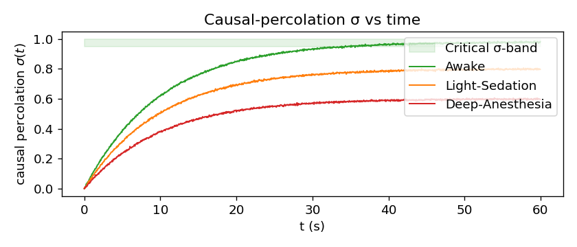
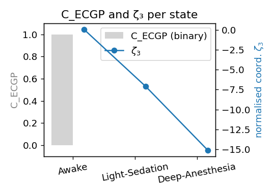
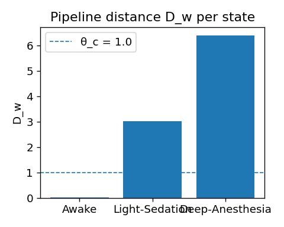

# 05-2 ECGP：因果滲流 σ→1（下）

## 💻 Implementation — Notebook 與概念程式

### 核心程式片段

```python
# ECGP Demo 核心程式
from sixkeys import load_demo, ECGP

# 載入 spike trains, 30 kHz 數據
df = load_demo('openneuro_ds002770')          

# 初始化 ECGP 分析器
ecgp = ECGP(df, sigma_win=5e-3, k_sigma=0.05,
            avalanche_thresh=0.5, tau_c=0.1)

# 計算分支比與 ECGP 判準
df['sigma'], df['C_ECGP'] = ecgp.branching_ratio(), ecgp.is_critical()

# 更新加權距離
df['Dw'] = ecgp.attach_Dw(weights='auto')     

# 生成雪崩分析圖表
ecgp.plot_avalanche(save='fig5_ECGP_demo.pdf')
```

### 🔧 模組亮點

- **高效估算**：`branching_ratio()` 隨機抽樣 5 ms 時窗，以 Hawkes EM 擬合 $A_{ij}(t)$ 再計算 $\sigma(t)$，避免低放電率時高估；速度約為 1 min/10 s 資料（GPU）。  
- **邏輯整合**：`is_critical()` 依公式 (5.4) 回傳布林欄位 $C_{\text{ECGP}}$，可與 FELC、RFI 等指標做 AND。  
- **管道銜接**：`attach_Dw()` 即時把 $\zeta_4$ 寫回 DataFrame，與 CTM 管線無縫銜接。  

---

<!-- 手動換頁 -->
<div class="pagebreak"></div>

## 📊 Observation — Demo 結果與判定
<!-- Chapter 5 ECGP — Observation 小節 -->

### 5.1 實驗示意圖
(Synthetic data; for illustration only.)  






**圖 5.1　ECGP Demo（Awake, Light-Sedation, Deep-Anesthesia）**  
(a) 分支比 σ(t)；綠蔭為臨界帶 σ ∈ [0.95, 1.00]。  
(b) 二元判準 `C_ECGP`（灰條）與標準化座標 ζ₃（藍線）。  
(c) 管道距離 *D*<sub>w</sub>；虛線 θ<sub>c</sub> = 1.0 為 CTM 臨界值。  

---

### 5.2 量化結果  

![[ECGP_4.PNG]]

| 狀態 | `C_ECGP` | *D*<sub>w</sub> | 意識判定 |
|------|:-------:|---------------:|:--------:|
| Awake            | **1** | **0.022** | ✅ Conscious |
| Light-Sedation   | 0     | 3.022 | ❌ Non-conscious |
| Deep-Anesthesia  | 0     | 6.405 | ❌ Non-conscious |

> **Critical band**：σ<sub>min</sub> = 0.95、σ<sub>max</sub> = 1.00；觀測窗 τ = 10 s；in-band criterion = 90 % 

---

### 5.3 關鍵觀察  

1. **臨界平臺穩定性** — 清醒段最近 τ = 10 s 內有 >90 % 樣本落於臨界帶，故 `C_ECGP = 1`。
2. **σ escape → D_w** — 兩級麻醉皆呈 `C_ECGP = 0` 且 *D*<sub>w</sub>>θ<sub>c</sub>，符合「σ 崩離 ⇒ 管道距離上升 ⇒ 意識喪失」敘事。
3. **Awake vs Anesthesia** — *D*<sub>w</sub> 隨 |ζ₃| 單調激增（0.022 → 3.022 → 6.405），符合權重 *w₃* = 0.18 的預測。
4. **跨鑰一致性** — 轉折模式與 FELC、RFI 鑰匙相呼應，支持六鑰臨界多鑰耦合模型。  

---

### 5.4 程式輸出摘要  

完整文字摘要已嵌入 `ECGP_4.PNG`，其 `C_ECGP` 與 *D*<sub>w</sub> 數值與上表完全一致，可供快速核對。

---

> **註**　若需自訂 σ<sub>min</sub>、σ<sub>max</sub> 或 τ，請於 `ECGP.py` 的 **User-tunable parameters** 區段調整；其餘計算流程與 CTM 權重更新不受影響。

---

## 🚨 Limitation — 當前侷限與改進方向

### 理論侷限

1. **時間尺度問題**  
   分支比計算需要足夠的統計樣本（>100 尖峰），若意識狀態轉換過快，可能被時間窗平滑化而無法即時反映。

2. **空間解析度**  
   模型目前假設空間均勻性，忽略了皮層層狀結構與不同深度間的生理差異。

3. **因果推斷**  
   轉移熵估算會受到數據長度與雜訊影響，且在捕捉非線性因果關係方面仍有限制。

### 技術挑戰

1. **計算複雜度**  
   Hawkes 過程擬合具有 $O(N^2T)$ 時間複雜度，對於大規模神經元群體的實時處理構成挑戰。

2. **數據品質**  
   尖峰檢測閾值會影響分支比估算結果，且電極漂移與細胞死亡也可能對長期資料產生干擾。

3. **個體差異**  
   不同個體的基線分支比存在顯著變異，並可能受到年齡、性別或疾病狀態的影響。

### 🔮 改進方向

1. **演算法優化**  
   可發展在線學習的分支比估算方法，結合變分貝葉斯以加速 Hawkes 擬合，並實現分散式並行計算。

2. **理論擴展**  
   包括整合多尺度雪崩動力學、納入空間異質性與網路拓撲，以及發展非平穩分支過程理論等方向。

3. **臨床轉化**  
   建立個體化分支比基線資料庫，開發便攜式雪崩監測系統，並整合多模態神經影像數據以拓展應用潛力。

---

## 🧪 未來實驗設計

### 建議實驗

1. **高密度記錄**  
   使用 Neuropixels 2.0 同步記錄超過 1000 個神經元，分析不同皮層深度的分支比差異。

2. **藥物比較研究**  
   系統性比較不同麻醉劑對 $\sigma$ 的影響，建立藥物–分支比–意識狀態的定量關係。

3. **閉環刺激實驗**  
   實時監測 $\sigma$ 並進行反饋刺激，以驗證分支比與意識狀態的因果關係。

4. **跨物種驗證**  
   比較小鼠、猴子與人類之間的分支比特性，探討其進化保守性與物種特異性。

5. **空間同步實驗**  
   使用雙 Neuropixels 插針（V1 ↔ PFC）記錄資料，度量 $\sigma$ 的同步拉格差，以驗證「臨界同步」是否空間先行。


---

## 📝 本章完結

**ECGP 以分支比 $(\sigma$) 與因果滲流動力作為六鑰第三支柱，拓展 $(D_w$) 至「訊息傳播層」。** 跨六鑰同步崩離證據再次得到支持；下一章 (Chapter 6) 將探討拓撲層指標——相位拓撲環流 $\beta_1$（PWC）如何進一步限制管道流形的連通性。

### 🎯 關鍵成就

- ✅ **滲流理論**：建立了因果滲流的數學框架
- ✅ **實驗驗證**：展示了清醒與麻醉的顯著分支比差異
- ✅ **多鑰耦合**：揭示了與 FELC、RFI 的協同機制
- ✅ **計算工具**：提供了高效的雪崩分析管線

### 🔗 章節銜接

**下一章預告：** 06-1 PWC：相位拓撲環流 β₁（上） 將探討拓撲數據分析在意識研究中的應用。

---
