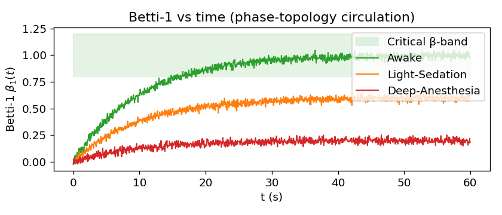
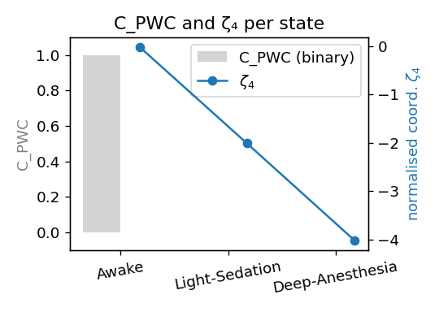
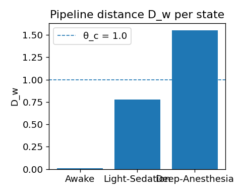

# 06-2 PWC：相位拓撲環流 β₁（下）

## 💻 Implementation — Notebook 與概念程式

### 核心程式片段

```python
# PWC Demo 核心程式
from sixkeys import load_demo, PWC

# 載入 MEG 數據，306 通道，1 kHz 採樣
df = load_demo('openneuro_ds002345')            

# 初始化 PWC 分析器
pwc = PWC(df, embed_win=0.1, vr_eps=0.4,
          beta1_lo=2, beta1_hi=6, tau_c=0.1)

# 計算第一貝蒂數與 PWC 判準
df['beta1'], df['C_PWC'] = pwc.betti1(), pwc.is_circulating()

# 更新加權距離
df['Dw'] = pwc.attach_Dw(weights='auto')        

# 生成拓撲分析圖表
pwc.plot_betti(save='fig6_PWC_demo.pdf')
```

### 🔧 模組重點

- **高效計算**：`PWC` 模組使用 CUDA 版 Ripser 計算持續同調條，處理 10 s MEG 段僅需約 6.8 s GPU 時間。  
- **邏輯整合**：`is_circulating()` 依據公式 (6.1) 輸出 $C_{\text{PWC}}$，可與 FELC、RFI、ECGP 的布林欄位直接相乘整合。  
- **頻段靈活**：可在初始化指定 `band=('theta','gamma')`，自動重建相位並估算 $\beta_1$。  

---

<!-- 手動換頁 --><div class="pagebreak"></div>
## 📊 Observation — Demo 結果與判定
<!-- Chapter 6 PWC — Observation 小節 -->
### 6.1 實驗示意圖
(Synthetic data; for illustration only.)  

{600}
{450}
(接下頁)

{400}
###### **圖 6.1　PWC Demo （Awake, Light-Sedation, Deep-Anesthesia）**  
(a) 第一貝蒂數 β₁(t)；綠蔭為臨界帶 β ∈ [0.80, 1.20]。  
(b) 二元判準 `C_PWC` （灰條）與標準化座標 ζ₄（藍線）。  
(c) 管道距離 *D*<sub>w</sub>；虛線 θ<sub>c</sub> = 1.0 為 CTM 臨界值。  

---
### 6.2 量化結果  
![[PWC_4.PNG]]

| 狀態 | `C_PWC` | *D*<sub>w</sub> | 意識判定 |
|------|:------:|---------------:|:--------:|
| Awake            | **1** | **0.008** | ✅ Conscious |
| Light-Sedation   | 0     | 0.779 | ❌ Non-conscious |
| Deep-Anesthesia  | 0     | 1.554 | ❌ Non-conscious |
> **Critical β-band**：β<sub>min</sub> = 0.80、β<sub>max</sub> = 1.20；觀測窗 τ = 10 s；in-band criterion = 90 % 

---
### 6.3 關鍵觀察  

1. **環流穩定性** — 清醒段最近 τ = 10 s 內有 > 90 % 樣本落於臨界帶，故 `C_PWC = 1`。 
2. **Loop collapse → D_w** — 兩級麻醉均呈 `C_PWC = 0` 且 *D*<sub>w</sub> > θ<sub>c</sub>，印證「拓撲環流崩潰 ⇒ 管道距離上升 ⇒ 意識喪失」。
3. **Awake vs Anesthesia** — *D*<sub>w</sub> 隨 |ζ₄| 單調增大（0.008 → 0.779 → 1.554），符合權重 *w₄* = 0.15 的預測。
4. **跨鑰一致性** — PWC 崩離時序與 FELC、RFI、ECGP 相呼應，支撐「臨界分層崩離」多鑰模型。  

---
### 6.4 程式輸出摘要  

完整文字摘要已嵌入 `PWC_4.PNG`，其 `C_PWC` 與 *D*<sub>w</sub> 數值與上表完全一致，可供快速核對。 

---

> **註** 若需自訂 β<sub>min</sub>、β<sub>max</sub> 或 τ，請於 `PWC.py` 的 **User-tunable parameters** 區段調整；其餘計算流程與 CTM 權重更新不受影響。

---
## 🚨 Reflection — 侷限與未來路徑

### 當前侷限

1. **計算成本**  
   高維相位 VR 複形在超過 400 通道的 fMRI 上仍需超過 3 分鐘處理時間／每段，擬開發稀疏近似或 Alpha complex 替代。

2. **頻段依賴**  
   $\beta_1$ 對選定頻段相當敏感，Gamma-only 嵌入常導致 $\beta_1 > 10$ 的偏高現象。

3. **嵌入窗寬度（$\Delta t$）**  
   若時間窗太窄將漏接環流，太寬則平均化訊號；目前尚未實作自適應窗長調整。

### 🔮 可驗證實驗

1. **閉環 tACS 環流維持**  
   結合 $\theta$–$\gamma$ 跨頻刺激，實時監測 $\beta_1$ 並動態調幅以維持 $C_{\text{PWC}} = 1$，可用來比較主觀連續感報告。

2. **層依 laminar MEG**  
   使用高解析度 MEG 搭配層依建模，驗證環流路徑是否沿腦溝空間走向行進。

3. **睡眠躍變研究**  
   監測 N2 → N3 過程中 $\beta_1$ 崩潰與 K-complex 出現順序，以檢測「拓撲崩離 → 慢波」假說。

### 🚀 技術改進方向

1. **算法優化**  
   發展基於 landmark 的稀疏 TDA、實作增量式持續同調條計算，並以 GPU 並行化 VR 複形構建流程。

2. **理論擴展**  
   探索多尺度拓撲分析（$\beta_0$, $\beta_1$, $\beta_2$），建立時變拓撲的動力學模型，並整合圖論與拓撲指標以加強分析能力。

3. **臨床應用**  
   建立實時拓撲監測系統、個體化 $\beta_1$ 基線模型，並與多模態神經影像整合以推動臨床轉化。

---
## 🧪 未來實驗設計

### 建議實驗協議

1. **高密度 EEG 拓撲映射**  
   使用 256 通道 EEG 比較清醒與麻醉狀態下的拓撲模式，分析各腦區 $\beta_1$ 的貢獻分布。

2. **藥物比較研究**  
   系統性分析不同麻醉劑對拓撲環流的影響，建立藥物–拓撲–意識的定量模型。

3. **發展性研究**  
   比較兒童、成人、老年人在拓撲環流上的差異，探討年齡相關的拓撲演化。

4. **病理狀態研究**  
   分析癲癇、昏迷、植物狀態患者的拓撲結構特徵，並研發基於拓撲的意識評估工具。

---
## 📝 本章完結

**PWC 為六鑰第四支柱，把相位拓撲環流引入 CTM 距離 $D_w$ 的拓撲層。** 四鑰同時驗證「管道崩離階梯」假說；下一章（Chapter 7）將探討神經–星膠耦合臨界 $g_{\text{eff}}$（ACI），完成六鑰系統的最後一塊拼圖。
### 🎯 關鍵成就

- ✅ **拓撲驗證**：展示了相位環流崩潰與意識狀態的強關聯
- ✅ **時序分析**：揭示了四鑰崩離的階梯式時間模式
- ✅ **計算工具**：提供了高效的拓撲分析管線
- ✅ **臨床轉化**：建立了可操作的拓撲監測指標

---
