### Figure 7‑0 🔑 ACI – 神經–星膠雙環耦合 (ζ₆)

{180}
###### 圖07-0.1 ACI – 神經–星膠雙環耦合 (ζ₆)
#### 因果映射
耦合效率 $g_{\text{eff}}(t)$ 介於 0（脫耦）與 1（完全耦合）。當 $g_{\text{eff}} \ge g_c = 0.65$ 並維持 $\tau_c \approx 150\,\mathrm{ms}$ 時，**$C_{\text{ACI}} = 1$**。
定義：
$$
\zeta_6 = \frac{g_{\text{eff}} - g_c}{\varepsilon_6}
$$
**實驗對應**：張（2025）表明，喉標刺激可提升鈣浪頻率（astro‑wave），導致 $g_{\text{eff}} \uparrow 0.78 \pm 0.05$，對應 **$\zeta_6 \approx 0.2$**；隨後觀測到前額葉 FELC 振幅上升 14%（延遲約 80 ms），符合六鑰序列預測。
映射權重 $w_6 = 0.06$ 為 $D_w^2$ 的末端微調成分：
$$
D_{w}^{2} = \sum_{i=1}^{6} w_i\,\zeta_{i}^{2}, \qquad \sum_{i=1}^{6} w_i = 1
$$
##### 關鍵公式
$$
C_{\text{ACI}} =
\begin{cases}
1, & \text{if } g_{\text{eff}}(t) \ge g_c \text{ for } \tau_c \\
0, & \text{otherwise}
\end{cases}
$$
---
