### 08-0 🔑 TEB – 資訊‑功率效率 (ζ₂ ≡ η)

{200}
###### 圖 08-0.1 TEB – 資訊‑功率效率 (ζ₂ ≡ η)

> *Weight note*: `w₂` 為暫定值；最終將全域正規化使 $(\sum_{i=1}^{6} w_i = 1)$。

---
#### 因果映射

當資訊–功率效率 $η_{\text{eff}}(t)$ 高於臨界值 $η_c = 0.35$ 並維持 $\tau_c \approx 200\,\mathrm{ms}$ 時，**$C_{\text{TEB}} = 1$**。定義：

$$
\zeta_2 = \frac{η_{\text{eff}} - η_c}{\varepsilon_2}
$$

效率下降（如睡眠或高鎂麻醉）導致 $η_{\text{eff}} \approx 0.28$，對應 **$\zeta_2 \approx -0.2$**，經加權 $w_2$ 納入：

$$
D_{w}^{2} = \sum_{i=1}^{6} w_i\,\zeta_{i}^{2}
$$

Tschantz 2023 模擬顯示，主動推斷網路在 $η_{\text{eff}}$ 低於 0.3 時會切換到「節能模式」，此狀態與六鑰模型預測的低意識–高 $D_w^2$ 狀態一致。

---

##### 關鍵公式

$$
C_{\text{TEB}} =
\begin{cases}
1, & \text{if } η_{\text{eff}}(t) \ge η_c \text{ for } \tau_c \\
0, & \text{otherwise}
\end{cases}
$$

---
###### 本章相關支撐文獻請參閱附錄C-3