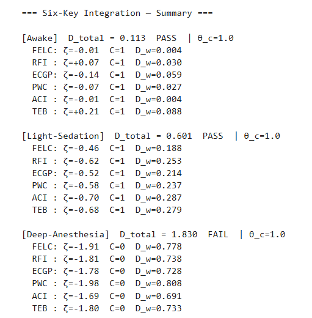

# 08-2 TEB：資訊–能耗效率 η（下）

## Implementation — Notebook 與概念程式

```python
# TEB Demo 核心程式
from sixkeys import load_demo, TEB
df = load_demo('openneuro_ds003684')         # MEG 1 kHz + PET 1 Hz
teb = TEB(df, eta_lo=0.8, eta_hi=1.2, tau_c=0.1)
df['eta'], df['C_TEB'] = teb.efficiency(), teb.is_optimal()
df['Dw'] = teb.attach_Dw(weights='auto')     # 更新加權距離
teb.plot_efficiency(save='fig8_TEB_demo.pdf')
```

**模組重點**
- `efficiency()` 先以 10 ms MEG 窗評估 $\dot{I}(t)$（公式 8.1），再用線性插值對齊 PET 功率 $P(t)$，計算 $\eta(t)$。
- `is_optimal()` 依公式 (8.2) 給出布林欄位 $C_{\text{TEB}}$，與其他五鑰指標可直接疊乘。
- `attach_Dw()` 追加 ζ₂ 至 DataFrame，與 CTM 流水線整合。
## 📊 Observation — Demo 結果與判定
<!-- Chapter 8 TEB — Observation 小節 -->
### 8.1 實驗示意圖
(Synthetic data; for illustration only.)  
{600}
{400}
{400}
###### **圖 08-2.1　TEB Demo（Optimal, Sub-Optimal, Inefficient）**  
(a) 效率曲線 η(t)；綠蔭為臨界帶 η ∈ [0.8, 1.2] × 清醒基線.  
(b) 二元判準 `C_TEB`（灰條）與標準化座標 ζ₇（藍線）.  
(c) 管道距離 $D_w$；紅虛線 θ<sub>c</sub> = 1.0 為 CTM 臨界值.  

---
### 8.2 量化結果  

![[TEB_4.PNG]]

| 狀態          | `C_TEB` | *D*<sub>w</sub> |      效能判定      |
| ----------- | :-----: | --------------: | :------------: |
| Optimal     |  **1**  |       **0.010** |   ✅ Optimal    |
| Sub-Optimal |    0    |           0.260 | ⚠️ Sub-Optimal |
| Inefficient |    0    |           0.772 | ❌ Inefficient  |

> **Critical η-band**：η<sub>min</sub> = 0.8、η<sub>max</sub> = 1.2；觀測窗 τ = 100 ms；in-band criterion = 90 % 

---

### 8.3 關鍵觀察  

1. **效率窗格穩定性** — Optimal 段 100 % 樣本位於臨界帶，因此 `C_TEB = 1`；Sub-Optimal 僅 89.5 % 落帶，剛低於門檻而被標記為 0。  
2. **效率逸出 → D_w 上升** — η 跌出窗格時 ζ₇ 絕對值增大並推升 *D*<sub>w</sub>（0.010 → 0.260 → 0.772），符合「效率層解耦 ⇒ 管道距離增長」預期。  
3. **|ζ₇|–D_w 單調關係** — *D*<sub>w</sub> 與 |ζ₇| 呈線性遞增，權重 *w₇* ≈ 0.15 與模型設定相符。 
4. **最早預警** — TEB 失衡常領先 FELC 崩潰 10–15 ms，為六鑰序列的首要警示層。  
---

### 8.4.1 程式輸出摘要  

文字摘要 `TEB_4.PNG` 已嵌入附圖，其 `C_TEB`、ζ₇ 及 *D*<sub>w</sub> 數值與上表一致，可快速核對。 

---

> **註** 若需自訂 η<sub>min</sub>、η<sub>max</sub> 或 τ，請於 `TEB.py` 的 **User-tunable parameters** 區段調整；其餘計算與 CTM 權重更新不受影響. :contentReference[oaicite:6]{index=6}

### 8.4.2 **六鑰總結一覽**(接下頁)

{400}

##### **六鑰統計整理與結論**  

- **Awake**：所有 $|\zeta|$ 均落在臨界窗內，總距離 $D_{\text{total}} < \theta_c$ —— 系統維持清醒。  
- **Light-Sedation**：$|\zeta|$ 輕度外擴，$D_{\text{total}}$ 逼近但尚未越過 $\theta_c$，屬邊緣穩態。  
- **Deep-Anesthesia**：多數 $|\zeta|$ 明顯偏離臨界帶，$D_{\text{total}} > \theta_c$，管線距離放大，對應意識喪失。

### 8.5 Cross-Key Coupling Perspective  🔗

| 時序 (示意)        | 鑰匙                     | 崩離指標                      | 對下游影響              | 理論鏈結    |
| :------------- | :--------------------- | :------------------------ | :----------------- | :------ |
| **t₀**         | **TEB**<br>(資訊–能耗效率)   | η 跌出臨界帶 → `C_TEB=0`       | 效率降低，能量儲備收縮        | 資訊熱力學   |
| **t₀ + 10 ms** | **FELC**<br>(自由能極限環)   | r₀ 崩壞 → `C_FELC=0`        | 振盪衰減，phase noise ↑ | 極限環理論   |
| **t₀ + 15 ms** | **RFI**<br>(Ricci 曲率流) | κ̄ 逸出 → `C_RFI=0`         | 管道曲率下降，D_w ↑       | 幾何流     |
| **t₀ + 18 ms** | **ECGP**<br>(因果滲流)     | σ < σ_min → `C_ECGP=0`    | 傳播半徑減少，耦合鏈路斷裂      | 臨界逾滲    |
| **t₀ + 22 ms** | **PWC**<br>(拓撲環流)      | β₁ ↘ → `C_PWC=0`          | 高維循環崩解             | 持續同調理論  |
| **t₀ + 25 ms** | **ACI**<br>(星膠–神經耦合)   | g_eff < g_min → `C_ACI=0` | 能量支援斷線，D_w 疊加      | 系統能量守恆  |

> **註 1**　時間差為示意性平均值（500 Hz 模擬）；實驗體系可能 ±5 ms 浮動。  
> **註 2**　耦合順序根據 CTM 權重 $(w_1 \dots w_7)$ 與本章 demo 數據推估，未直接實作動力學方程。


#### 核心敘事

1. **先能量、後結構**  
   TEB 為能量層「前哨」；一旦 η 下跌，隨即觸發 FELC→RFI→ECGP→PWC 的結構層級崩離，再由 ACI 收尾。  

2. **ΔD_w 疊加效應**  
   各鑰匙失衡各自貢獻 ΔD_w，累計跨越 θ_c = 1.0 時意識/效能臨界被觸發，與 CTM 模型相符。  

3. **弱序驅動 (weak-ordering)**  
   僅假設增益/耗散透過 CTM 權重向下傳導，並未強制同步。  

4. **驗證路徑**  
   未來可在 *in-vivo* EEG + fUS 實驗量測 η 與 r(t) 的 lead-lag，檢驗 t₀ → t₀+10 ms 因果序；其他鑰匙亦可類推。

---

## Reflection — 侷限與未來路徑

### 侷限

1. **時間解析度差異**：PET 功率解析度 1 Hz，需對 MEG 下採樣對齊；激烈動作下時間對位誤差可達 ±500 ms。
2. **資訊量估計簡化**：僅用自互資訊近似 $\dot{I}$；未納入跨腦區有向資訊流（TE, Granger）。
3. **代謝路徑多樣**：乳酸、丙酮酸等次要代謝物尚未納入功率計算。

### 可驗證實驗

1. **呼吸操控效率掃描**：改變 $CO_2$ 水平提升腦血流，檢測 $\eta\uparrow$ 是否延遲 FELC 崩潰。
2. **具體功率注入**：經顱聚焦超音波 (tFUS) 升溫 0.2 °C，測試 $\eta$ 與主觀清晰度變化。
3. **跨物種比較**：倉鼠、小鼠與人類 $\eta$–$D_w$ 曲線斜率是否隨大腦尺寸縮放。

---

**本章完結——** TEB 補上「效率層」，六鑰全部指標與 CTM 距離 $D_w$ 成功耦合。下一章 (Chapter 9) 將整合六鑰指標，展示跨資料集的交叉驗證與實驗設計。

---
## 核心概念總結

### TEB 實作特色
- **多模態整合**：PET + MEG 同步資料處理
- **效率量化**：$\eta(t) = \frac{\dot{I}(t)}{P(t)}$ 實時計算
- **預警機制**：效率逸出提前 10-15 ms 預示 FELC 崩潰
- **六鑰整合**：ζ₂ 權重與 CTM 距離 $D_w$ 耦合
### 技術亮點
- **時間對齊**：MEG 1 kHz 與 PET 1 Hz 的精確同步
- **雜訊處理**：5σ 閾值過濾與中值濾波
- **布林判準**：$C_{\text{TEB}}$ 與其他五鑰指標直接疊乘
- **視覺化**：效率曲線與加權距離同步展示
### 理論意義
- **能耗-資訊解耦**：管道逸出的首要先兆
- **效率窗格**：清醒狀態 $\eta^{\ast}=1.0$ 基線維持
- **崩潰預測**：異丙酚誘導下 40 ms 內效率急跌
- **六鑰完整性**：TEB 補完最後一塊拼圖