# 10-1 關鍵三鑰與神經流形動力學

> **本章結構**依循分形五格 **P–F–I–O–R** 模板，整合六鑰中最仰賴「神經流形」概念的三把鑰匙──FELC、RFI、PWC──於同一章節，展示它們如何在同一潛在流形上交織出意識臨界管道 $\pi(\Sigma_{\mathrm{CT}})$。

---

## 0 導論：為何三鑰合併？ *(P & F 綜述)*

### Purpose (P)

* **統一視角**：FELC（能量旋子）、RFI（幾何曲率）、PWC（拓撲環流）皆屬「流形動力」層次；分開敘述會削弱其共振性。
* **真相指引**：若意識穩態真為一條「臨界細管」，那麼三鑰就像從能量、幾何、拓撲三個正交投影去「描邊」這條管道——缺一面則輪廓不完整。

### Formulation (F)

> 給定高維神經活動 $X(t)\in\mathbb{R}^N$，經非線性嵌入 $f$ 得潛在流形座標
>
> $$
>  \mathbf{x}(t)=f\bigl[X(t)\bigr]\in\mathcal{M}^{d},\qquad d\ll N.
> $$
>
> 在同一 $\mathcal{M}^d$ 上，我們觀察
>
> 1. **FELC** : 存在穩定極限環 $\mathcal{C}\subset\mathcal{M}^d$，半徑
>    $r_0\pm\Delta r$。
> 2. **RFI** : 平均 Ricci 曲率
>    $\bar{\kappa}(t)\to 0$。
> 3. **PWC** : 第一貝蒂數
>    $2\le\beta_1(t)\le6$。
>
> 三者若同時滿足各自臨界窗格，即可證明狀態點仍被束縛於臨界管道內。

---
<!-- 手動換頁 -->

## 1 FELC ─ 自由能極限環 *(P–F–I–O–R)*

### P

* 從 **能量觀點**檢視流形：意識需要維持低振幅週期性自振，以避免能量陷落。

### F

* 在降維子空間 $(F,G)\subset\mathcal{M}^d)$ 定義 Hopf 系統

> $$
>  \begin{cases}
>   \dot F=\lambda F-\alpha F^{3}+\beta G\\[4pt]
>   \dot G=-\omega F+\gamma G-\delta G^{3}
>  \end{cases}
> $$

* 判準：$C_{\mathrm{FELC}}=1$ 若

> $r_0-\Delta r\le \lVert(F,G)\rVert\le r_0+\Delta r\text{ 且持續 }\tau_C$.

### I

1. **嵌入**：jPCA 或 LFADS 將 $X(t)$ 投影至二維旋子平面。
2. **估參**：Bayesian filter 擬合 $(\lambda,\alpha,\dots)$。
3. **環檢測**：滑動計算半徑序列 $r(t)$。

### O

* 覺醒 MEG 顯示 $r(t)\approx0.14\pm0.02$；丙泊酚 30 s 內收斂至固定點。
* 極限環收縮 ⇒ $|\zeta_1|\uparrow$ ≈ 0.8，帶頭推升 $D_w$。

### R

* **侷限**：Hopf 假設僅二維；未含空間耦合。
* **改進**：多頻段 LFADS，可於 $\gamma–\beta$ 交替頻帶獨立擬環。

---
<!-- 手動換頁 -->

## 2 RFI ─ Ricci 曲率臨界流 *(P–F–I–O–R)*

### P

* **幾何韌性觀點**：意識網絡需兼具傳輸效率與抗噪；平均曲率趨零是「最佳折衷」的幾何標記。

### F

> $$
>  \bar{\kappa}(t)=\frac1{|E|}\sum_{(i,j)\in E}w_{ij}(t)\,\kappa_{ij}(t),
>  \qquad C_{\mathrm{RFI}}=1\iff \lvert\bar{\kappa}(t)\rvert\le\kappa_c.
> $$

### I

1. **圖生成**：在流形座標上建 $k$-NN 圖。
2. **曲率估計**：Ollivier–Ricci 或 Forman–Ricci GPU 版。
3. **流演化**：局部時間窗內計算 $\partial_t g_{ij}$。

### O

* 清醒：$\bar{\kappa}=0.003\pm0.02$；麻醉：$-0.07\pm0.01$。
* $|\zeta_2|$ 在 FELC 崩落後 20 ms 內飆升兩倍，符合「能量→幾何躍遷」次序。

### R

* **侷限**：高維圖 $>10^4$ 邊計算耗時。
* **改進**：使用 Graph Neural Ricci (GNR) 估計器 + sparse landmark。

---
<!-- 手動換頁 -->

## 3 PWC ─ 相位拓撲環流 *(P–F–I–O–R)*

### P

* **拓撲保持觀點**：意識需保持跨頻耦合訊息的「回路容器」；回路破裂 → 資訊不再反饋。

### F

* 建立相位點雲 $\mathcal P(t)\subset \mathbb{T}^d$，以 Vietoris–Rips 複形求 persistent $\beta_1(t)$。
* 判準：$C_{\mathrm{PWC}}=1$ 若 $2\le\beta_1\le6$ 且 $|\dot\beta_1|\le0.2$。

### I

1. **相位抽取**：Hilbert 解析；滑窗嵌入 100 ms。
2. **TDA**：CUDA Ripser / Ripser++ 求條；閾值 $\epsilon=0.4$。

### O

* 覺醒 $\beta_1=3.8\pm0.6$；深麻醉 $\beta_1<0.5$。
* $\beta_1$ 崩潰滯後 RFI ≈ 15 ms，與多鑰階梯吻合。

### R

* **侷限**：$>400$ channel VR 複形仍耗時。
* **改進**：landmark TDA + incremental persistence。

---
<!-- 手動換頁 -->

## 4 綜合視角：三鑰在流形上的臨界圍籬 *(O & R)*

### 關鍵觀察

| 順序     | 事件           | 流形指標變化                | $\Delta D_w$ 典型值           |
| ------ | ------------ | --------------------- | -------------------------- |
| 1      | FELC 環半徑收縮   | $\zeta\_1\uparrow0.4$ | +0.15                      |
| 2      | 曲率負偏離        | $\zeta\_2\uparrow0.8$ | +0.10                      |
| 3      | $\beta_1$ 崩潰 | $\zeta\_5\uparrow1.2$ | +0.12                      |
| **合計** | ——           | ——                    | **+0.37 ≫ $\theta_c=0.5$** |

> **結論**：三鑰共振後，$D_w$ 必定突破臨界閾值，預示意識失穩。

### 待解問題

1. **流形真實度**：降維方法是否保留高維信息？
2. **因果方向**：環流崩潰是否必然導致曲率負偏？需要介入實驗驗證。
3. **跨個體泛化**：流形座標對不同腦型是否可對齊？

---

## 5 本章小結

* **三鑰合併 = 一座三面鏡**，能量 (FELC)、幾何 (RFI)、拓撲 (PWC) 共同映照神經流形的臨界管道。
* **意識真相進一步輪廓**：若三面鏡同時破裂，$\pi(\Sigma_{\mathrm{CT}})$ 失守，主觀覺醒隨之消散。
* **後續工作**：設計封閉迴路刺激，針對流形三鑰的微擾回饋，看是否能**逆轉** $D_w$ 的崩離路徑。

---

<!-- 手動換頁 -->

## 關鍵三鑰與神經流形整合架構圖

> 本圖用於輔助理解六鑰框架中，三鑰（FELC, RFI, PWC）如何對應神經流形動力學的幾何與拓撲特徵。圖中不含數學公式，僅呈現結構流程與關聯。詳細數學公式見原章節說明。

---
###### 圖10-1.1關鍵三鑰與神經流形整合架構圖

<!-- 手動換頁 -->

### 補充說明（LaTeX 數學）

潛在流形座標投影：

$$
    \mathbf{x}(t) = f[X(t)] \in \mathcal{M}^d,
    \quad d \ll N
$$

三鑰臨界條件（各對應 ζ）：

$$
\begin{aligned}
  &\text{FELC:} & C_{\mathrm{FELC}} &= 1 \iff r_0 - \Delta r \le \|\mathbf{x}\| \le r_0 + \Delta r \\
  &\text{RFI:}  & C_{\mathrm{RFI}} &= 1 \iff |\bar{\kappa}| \le \kappa_c \\
  &\text{PWC:}  & C_{\mathrm{PWC}} &= 1 \iff 2 \le \beta_1 \le 6
\end{aligned}
$$

三鑰貢獻之加權距離：

$$
    D_w^2 = w_1\zeta_1^2 + w_2\zeta_2^2 + w_5\zeta_5^2
$$

CTM 管道狀態由六鑰 ζ 是否逸出決定，若 $D_w^2 > \theta_c^2$，則 CTM 崩離。

