## G1.1  理論定位 — Six-Key Criticality ⇄ Six-Goldstone Field Theory

> 「六鑰臨界」給我們一塊 **6 個旋鈕 + 一條距離 $D_w$** 的即時儀表板；  
> 「六 Goldstone 場論」則回答：為何恰好需要這 6 把鑰匙，以及各自的『出廠標定』是多少。  
> 二者組合後，既能量測又能被否證，可把工程級指標推進到嚴謹的第一性理論。

### ✦ 一分鐘 pitch（接下頁）

{450}

---
<!-- 手動換頁 -->

### 框架對照

| 面向        | **六鑰臨界** (Six-Key Criticality)                                     | **六-Goldstone FT**                                                                                                                                                                                |
| --------- | --------------------------------------------------------------------- | ------------------------------------------------------------------------------------------------------------------------------------------------------------------------------------------------- |
| **目標**    | 以 6 個指標 $\zeta_{1\text{–}6}$ 量化意識臨界管道；可直接對接 EEG / MEG / fMRI / 雙光子資料  | 找出強迫「恰有 6 個指標」浮現的基本守恆量與對稱性；寫成單一作用量 $S$                                                                                                                                                            |
| **數學核心**  | 臨界管道流形 $\Sigma_{\mathrm{CT}}$ + 加權距離 $D_w=\sqrt{\sum_i w_i\zeta_i^2}$ | 自發對稱破缺  $$G=U(1)\_{\phi}\times\mathbb R^{+}_{\!\sigma}\times SO(3)\_{n}\times U(1)\_{\tau}\;$$ $$\longrightarrow\;H=\{1\},\;\dim(G/H)=6$$  真空流形 $$\mathcal M_{\text{vac}} = G/H \simeq S^{6}$$ |
| **驗證方式**  | 觀測 $\zeta_i$ 是否同時落在臨界窗格；閉迴路實驗單獨拉出某 $\zeta_i$ 檢驗意識是否崩潰                 | 量測臨界指數、Goldstone 耗散譜、近守恆流 $(E, I, \chi)$；設計「可證偽試驗」逐一否證                                                                                                                                            |
| **實作成熟度** | 已有 Python SDK、Demo、Docker；臨床 / BCI 可即時落地                              | 目前為 proposal 0.x；需數值模擬 $\sigma$-model (O(7)/O(6) ≅ S⁶) 與 in-vivo 驗證                                                                                                                               |

---

### 為何非要「6 把鑰匙」不可？

* 在忽略額外 Gauge 投影的前提下，生物邊界條件將全域對稱群 **完全破缺**，真空流形為 $S^{6}$；其維數恰為 6 ⇒ 必然留下 **6 個 Goldstone 模**，正好對應 $\zeta_{1\text{–}6}$.  
* 任何其他模式的質量 $m > m_0$、壽命 $<10$ ms，已在 coarse-graining 中被平均掉；於 100 ms 「可報告窗」內唯有六鑰得以存活。

---

### 雙層協同的路線圖（概要）

1. **短期**：利用六-Goldstone 場論給出的 RG 固定點，重新計算六鑰權重 $w_i$，並對公開資料交叉驗證。  
2. **中期**：完整數值模擬 NLσM 於 O(7)/O(6) ≅ S⁶，確認只剩 6 條無質量譜線。  
3. **長期**：動物閉迴路實驗──單參數將某 $\zeta_i$ 拉出管道，觀測行為斷點是否如理論預測。

---

> **一句話總結**：六鑰臨界 = 可操作 **frontend**，六-Goldstone FT = 第一性 **backend**；前者量測、後者解釋，缺一不可。

## G1.2  G → H 自發對稱破缺與 vacuum $\boldsymbol{S^{6}}$

> **核心命題**  
> 大腦–星膠聯網的有效全域對稱群  
> 
 $$
 G = U(1)_{\phi}\;\times\;\mathbb R^{+}_{\!\sigma}\;\times\;SO(3)_{n}\;\times\;U(1)_{\tau}
 $$
> 
> 在生物邊界條件下 **完全破缺**為平庸群 $H = \{1\}$。  
> 因而留下 $\dim(G/H)=6$ 個低能自由度，恰好構成六鑰 $\zeta_{1\text{–}6}$；接下來用 Goldstone–6–CFT 來描述其臨界動力。

---
### 真空流形的幾何：$\mathbb R^{7}\ \to\ S^{6}$

| 步驟  | 幾何／方程                                                         | 物理解釋                                                                 |
| --- | ------------------------------------------------------------- | -------------------------------------------------------------------- |
| 1   | **嵌入** $\Phi(x)\in\mathbb R^{7}$                              | 先引入 7-維實向量場，備有一個徑向 + 六個角向                                            |
| 2   | **勢阱鎖定** $V(\Phi)=\lambda\left(\|\Phi\|^{2}-v^{2}\right)^{2}$ | 令徑向模 $\rho=\lvert\Phi\rvert$ 有質量 $m_{\rho}^{2}=4\lambda v^{2}$，成為重粒子 |
| 3   | **單位向量約束** $\;U(x)=\Phi(x)/v\in S^{6}\cong SO(7)/SO(6)$       | 把徑向凍結在 $\rho=v$，留下 6 個角向 Goldstone——目標空間即真空流形                        |

> **備註**  若省略第 2 步，徑向亦為零本徵值，將錯算成 **7** 個 Goldstone；勢阱鎖定確保僅餘 6 個無質量角向模，並使 RG 流量易於收斂。

---

###### 圖1.2 自發對稱破缺與6個GoldStone模

---
### 生成元 $T_i$ 與六鑰對映

| $T_i$ | 群分量 | 生物意涵 | 指標 $\zeta_i$ |
|---------|--------|----------|----------------|
| $T_1$ | $U(1)_{\phi}$ | 代謝相位 | $\zeta_1$ |
| $T_2$ | $\mathbb R^{+}_{\!\sigma}$ | 資訊尺度（dilaton-like） | $\zeta_2$ |
| $T_{3,4,5}$ | $SO(3)_{n}$ | 空間取向 x / y / z | $\zeta_{3,4,5}$ |
| $T_6$ | $U(1)_{\tau}$ | 拓撲纏繞相位 | $\zeta_6$ |

> 在 $SO(7)$ 的反對稱基 $T_{i7}-T_{7i}$ 上可顯示六生成元；它們兩兩不對易，但在低能有效度規下呈近似等向剛度。

---

### 為何生物邊界條件迫使 $H=\{1\}$？

* **代謝鎖定**：能量供應鏈選定 $\phi$ 相位 ⇒ $U(1)_{\phi}$ 顯式破缺  
* **感官取向**：外部輸入破三軸等向 ⇒ $SO(3)_{n}$ 選向  
* **訊息稀釋**：星膠慢變耦合固定 $\mathbb R^{+}_{\!\sigma}$ 尺度  
* **網路拓撲**：連結圖約束移除 $U(1)_{\tau}$ 自由度  

因此真空僅剩單點，$\;H=\{e\}\;\Rightarrow\;\dim(G/H)=6$.

---

### 從 Goldstone $\psi_i$ 到宏觀六鑰 $\zeta_i$

$$
\Psi_i(t)=\frac{1}{|\Omega|}\int_{\Omega}\psi_i(x,t)\,d^{3}x
$$

空間平均後的零模即為可測指標 $\zeta_i$。若任何 $\psi_i$ 被「上質量化」→ 軌跡脫離臨界細管 $\Sigma_{c}$，可於行為層面立刻驗證。

---

### 實驗意涵速覽

* 兩把 pseudo-Goldstone（$\zeta_{1,2}$）雖帶軟質量，但在 100 ms 報告窗內仍近似臨界——這正是「麻醉階梯」可靈敏鉤住能量／尺度流的原因。  
* 任測得「第七把軟模」或證明刪除任一 $\zeta_i$ 而意識不崩潰 ⇒ 本場論即遭否證。

---

## G1.3  作用量 $L$ 與三條（近）守恆流

> **目的**：寫下一個既能產生「六鑰」又兼顧非平衡特性與拓撲耦合的 **最小** 場論骨架。  
> 完整處理需用 Schwinger–Keldysh (SK) 形式；下列先給單線索寫法，並標注其物理意涵與下一步擴充方向。

---

### 1. 四分式 Lagrangian

$$
S=\!\int\! d^{4}x\,L,\qquad  
L = L_{0}+V+L_{\text{diss}}+L_{\text{top}} .
$$

| 區塊            | 公式                                                                                                                                 | 物理角色                                  |
| ------------- | ---------------------------------------------------------------------------------------------------------------------------------- | ------------------------------------- |
| **動力項（NLσM）** | $L_{0}= \dfrac{\kappa}{2}\,\text{Tr}\!\bigl[(U^{-1}\partial_{\mu}U)(U^{-1}\partial^{\mu}U)\bigr],$ $\;U\in SO(7)/SO(6)\cong S^{6}$ | 六個 Goldstone 的可逆運動                    |
| **潛能項（徑向鎖定）** | $V=\lambda\bigl(\Psi^{2}-v^{2}\bigr)^{2}$                                                                                          | 令徑向模帶質量，真空限制在 $S^{6}$                 |
| **耗散 + 噪音**   | $L_{\text{diss}} = -\gamma\,U_{a}\,\bigl(\partial_{t}-D\nabla^{2}\bigr)U_{r}\!+\;iT_{\!\text{eff}}\gamma\,U_{a}^{2}$               | 以 SK 雙複本 $(U_{r},U_{a})$ 描述不可逆、滿足 FDT |
| **拓撲耦合**      | $L_{\text{top}} = \theta\,\varepsilon^{\mu\nu\rho}\,a_{\mu}\partial_{\nu}a_{\rho},\quad a_{\mu}=f(\Psi)$ (取皮層 2+1D 切片)          | 把纏繞荷／螺旋波寫成 2+1D Chern–Simons          |

> • 若需 3+1D 描述，可改用 Wess–Zumino–Witten 或 BF 型耦合。  
> • 耗散塊已含噪音；省略噪音即破壞 FDT，守恆流將不閉合。

---

### 2. 三條「近守恆」流

$$
\partial_{\mu}J^{\mu}_{A}= -\Gamma_{A}\,J_{A}+\xi_{A},
\qquad A = E,\;I,\;\chi .
$$

| 流名 $A$ | 近守恆式 | 物理解讀 | 關聯鑰匙 $\zeta_i$ |
|---------|-----------|-----------|----------------------|
| $E$     | $\partial_{\mu}T^{\mu0}= -\Gamma_{E}\,T^{\mu0}+\xi_{E}$       | 能量／代謝流         | $\zeta_{1},\;\zeta_{2}$ |
| $I$     | $\partial_{\mu}J^{\mu\nu}= -\Gamma_{I}\,J^{\mu\nu}+\xi_{I}$   | 資訊張量流           | $\zeta_{3},\;\zeta_{4},\;\zeta_{5}$ |
| $\chi$  | $\partial_{\mu}K^{\mu}= -\Gamma_{\chi}\,K^{\mu}+\xi_{\chi}$   | 拓撲荷・環流         | $\zeta_{6}$ |

$\Gamma_{A}$ 為衰減率，由 $\gamma, D$ 決定；  
$\xi_{A}$ 為高斯白噪，滿足 $\langle\xi_{A}(t)\,\xi_{A}(t')\rangle = 2\,\Gamma_{A} T_{\!\text{eff}}\delta(t-t')$。

---

### 3. 重要符號對照（表 G-1）

| 符號 / 參數              | 物理意義          | 關聯鑰匙                 | 備註                         |
| -------------------- | ------------- | -------------------- | -------------------------- |
| $\kappa$           | NLσM 剛度       | $\zeta_{1}$ 振盪頻率   | RG 固定點 $\kappa^{\ast}$   |
| $\lambda$          | 徑向鎖定強度        | 徑向穩定性                | $\lambda>0$ 保證回彈         |
| $v$                | 真空半徑          | 細管中心                 | 決定 $D_{w}$ 原點            |
| $\gamma$           | 耗散係數          | 與所有 $\zeta_i$ 噪音相關 | 可被星膠 Ca²⁺ 調控               |
| $D$                | 擴散常數          | ——                   | 控制 $\Gamma_{A}$          |
| $T_{\!\text{eff}}$ | 有效溫度          | ——                   | 非平衡雜訊幅度                    |
| $\theta$           | CS 耦合常數       | $\zeta_{6}$        | 決定螺旋波手性                    |
| $a_{\mu}$          | 合成 $U(1)$ 場 | ——                   | $a_{\mu}=f(\Psi)$ 保證變分閉合 |

---

### 使用指南

1. **理論→實驗**：  
   * 給定 $L$ 便可導出六維 Langevin，計算軟模譜線、相關長度與 $\Gamma_{A}$。  
2. **實驗→否證**：  
   * 若觀測到第七條無質量譜線或某 $\zeta_i$ 被重質量化仍保留意識 ⇒ 推翻本 $L$。  

> 想先概覽，可回 G1.1 的 pitch 圖；想做數值，請直奔 G1.8 的 Python demo。

## G1.4  從場論到六鑰 ODE ——「高維 ➜ 低維」收斂流程  

> **折疊目標**：把 $10^{9}$ 級神經–星膠態空間 $X(t)$ 依序通過  
> ① 連續場粗粒化 → ② Goldstone NLσM → ③ 空間零模投影，  
> 最終壓縮成一條 **六維隨機微分方程**  以便實驗與數值直接操控。
 $$
   \dot{\boldsymbol\Psi}=F(\boldsymbol\Psi)+\eta(t)
$$  
### ✦ 流程鳥瞰

---
### ① 連續場粗粒化  $(X_i \mapsto \mathcal C_a)$

* 高維向量：$X_i(t)\in\mathbb R^{N},\;N\sim10^{6{~}\text{–}~}10^{9}$  
* 粗粒化核：$\displaystyle \mathcal C_a(x,t)=\sum_{i}K_{ai}(x)\,X_i(t)$  
  * 核函數 $K_{ai}(x)$ 滿足 $\int\!K_{ai}=1$，支撐長度 ≈ 50 µm  
* 空間解析度：10 µm – 1 mm；時間解析度：0.1 ms  

---
### ② 連續場 → Goldstone NLσM  $(\mathcal C_a \mapsto \psi_i)$

* 將 $\mathcal C_a(x,t)$ 嵌入目標空間 $SO(7)/SO(6)\cong S^{6}$：  
  $$
    U(x)=\exp\!\Bigl[\sum_{i=1}^{6}\psi_i(x,t)\,T_i\Bigr],
  \qquad T_i = E_{i7}-E_{7i}.
  $$
* 自發對稱破缺：$SO(7)\!\rightarrow SO(6)$，留下 6 個角向 Goldstone，質量 $m_{\psi}=0$（或亞 mHz 級 pseudo-GB）。  

---
### ③ 空間零模平均  $(\psi_i \mapsto \Psi_i)$

$$
  \Psi_i(t)=\frac{1}{|\Omega|}\int_{\Omega}\psi_i(x,t)\,d^{3}x,
\qquad
  |\Omega|\approx100\text{–}1000\;\mu\text{m}^{3},\;
  \Delta t\approx100\text{ ms}.
$$

得到六維向量 $\boldsymbol\Psi(t)=(\Psi_1,\dots,\Psi_6)$。  
此處已將所有 $k\neq0$ 模積分掉，殘留 **六鑰零模**。

---
### ③′ 無量綱化  $(\Psi_i \mapsto \zeta_i)$

為了統一量綱並穩定數值，定義  
$$
  \zeta_i(t)=\frac{\Psi_i(t)-\mu_i}{\sigma_i},
\qquad
  \boldsymbol\zeta=(\zeta_1,\dots,\zeta_6),
$$
其中 $\mu_i,\sigma_i$ 為長窗平均與標準差（或其他基準）。

---
### ④ 六維隨機動力方程

$$
  \boxed{\;
    \dot{\boldsymbol\zeta}=J(\boldsymbol\zeta)\,\boldsymbol\zeta
    -2\lambda\bigl(\lVert\boldsymbol\zeta\rVert^{2}-v^{2}\bigr)\boldsymbol\zeta
    -(\nabla_{\!\zeta}\nu)\odot\boldsymbol\zeta
    +\eta(t)\;}
$$

* $J(\boldsymbol\zeta)$：來自拓撲耦合／Noether 投影的反對稱矩陣  
* $\nu(\boldsymbol\zeta)=\nu_0+\nu_g\,g_{\text{eff}}(\boldsymbol\zeta)$：星膠耗散  
* $\odot$：Hadamard 乘法（分量對分量）  
* 噪聲：$\displaystyle \eta(t)\sim\mathcal N\!\bigl(0,\;2\nu_0 k_{\!B}T_{\text{eff}}\bigr)$；若採 Stratonovich 需註明  

---
### 臨界細管（管道）定義

$$
  D_{W}(\boldsymbol\Psi)=
  (\boldsymbol\Psi-\boldsymbol\Psi^{\!*})^{\!\top}
  W\,
  (\boldsymbol\Psi-\boldsymbol\Psi^{\!*})\le\varepsilon.
$$

駐留於 $\Sigma_{c}=\{D_{W}\le\varepsilon\}$ 長於 $\tau_{c}\approx100\text{–}200$ ms  
⇔ 可操作定義的「意識在線」。

---

> **備註**  
> * 若在 $0.5\text{–}20$ Hz 頻段探得第七條軟模 ⇒ $\dim(G/H)\neq6$ → 理論需修正。  
* RG 流量與 SDE 參數對映詳見 G1.7；可證偽試驗設計移步 G1.5。

### 🔎 尺度與符號速查

| 符號            | 定義／範圍                                                |
| ------------- | ---------------------------------------------------- |
| $\Omega$      | 空間區段，$\Omega\approx100\text{–}1000\;\mu\text{m}^{3}$ |
| $\psi_i(x,t)$ | Goldstone 場（局域，$i=1\!\dots\!6$）                      |
| $\Psi_i(t)$   | $\psi_i$ 於 $\Omega$ 的體積平均（零模）                        |
| $\zeta_i(t)$  | $\Psi_i$ 標準化後的無量綱分量                                  |
| $N$           | 神經元＋星膠總數，$10^{6}\!-\!10^{9}$                         |
| 時間窗           | $\Delta t\approx100\;\text{ms}$                      |
| $m_{\psi}$    | Goldstone 質量 = 0 (pseudo-GB < 1 Hz)                  |
| $\lambda,v$   | Landau–Ginzburg 係數                                   |
| $J,\;\nu$     | 拓撲耦合矩陣、黏滯函數                                          |

> 備註  
• Quartic 勢取導給出係數 $-2\lambda$；若採其他歸一化請明示。  
• Hadamard 乘法 $\odot$ 保證各維度一致。  
• 緩變條件寫作 $|\nabla\psi|\ll1$ 以契合三維場。

---
### 1. 空間零模：$(\psi_i(x,t) \longrightarrow \Psi_i(t)$)

$$
\Psi_i(t)=\frac{1}{|\Omega|}\int_{\Omega}\psi_i(x,t)\,d^{3}x,
\qquad i=1,\dots,6.
$$

$\Omega$ 為 100–1000 µm 級皮層子區塊；在「慢變」視窗可忽略 $(\partial_x\psi_i$)。

---
### 2. Euler–Lagrange → 一階隨機動力系統

對 $(S=\int\!L\,d^{4}x$) 變分後於 $(\Omega$) 平均（高質量模 $\Xi_{\alpha}$ 已積掉）得

$$
\kappa\,\ddot{\Psi}
+\partial_{\Psi}V
+\nu(\Psi)\,\dot{\Psi}
=J_{\text{topo}}(\Psi)+\Gamma(u,t).\tag{2.1}
$$

引入 $\dot{\Psi}\equiv\mathbf v$ 可化為一階形：

$$
\dot{\Psi}=J(\Psi)\Psi
-2\lambda\!\bigl(\lVert\Psi\rVert^{2}-v^{2}\bigr)\Psi
-(\nabla_{\Psi}\nu)\odot\Psi
+G(u,t)+\eta(t).\tag{2.2}
$$

* $J(\Psi)$：由拓撲耦合／Noether 投影而來的反對稱矩陣  
* $\eta(t)$：高斯白噪，$\langle\eta(t)\eta(t')\rangle=2\nu_0k_{B}T_{\text{eff}}\delta(t\!-\!t')$  
* 方程採 Stratonovich 約定；若用 Itô 請加半位移修正  

---
### 3. 收斂到臨界細管 \(\Sigma_c\)

* **加權距離**  
  $$
    D_{W}(\Psi)=\sqrt{(\Psi-\Psi^{*})^{\!\top}W(\Psi-\Psi^{*})}.
  $$
* **細管**  
  $(\displaystyle\Sigma_c=\{\Psi\mid D_{W}\le\varepsilon\}$)  
  係徑向收縮 ($(\lambda_{\perp}<0$))、切向臨界 ($(\lambda_{\parallel}\approx0$)) 的吸引流形。  
* **意識存活判準**  
  $(\Psi(t)\in\Sigma_c$) 持續 $(\tau_c\simeq100$) ms ⇔ 報告式意識「在線」。

---
### 4. 最終六維 ODE（實驗版）

$$
\boxed{
\dot{\boldsymbol\Psi}=F(\boldsymbol\Psi)+\eta(t)},\qquad
F=J\Psi-2\lambda\bigl(\lVert\Psi\rVert^{2}-v^{2}\bigr)\Psi
-(\nabla_{\!\Psi}\nu)\odot\Psi .
\tag{4.1}
$$

* **狀態向量** $\boldsymbol\Psi\equiv(\zeta_1,\dots,\zeta_6)$：即「六鑰」。  
* **參數組** $(\kappa,\lambda,v,\nu_0,\nu_g,\theta)$ 由 RG 流固定；其數值可直接向 G1.8 demo 查詢。  
* **外控源** $G(u,t)$：麻醉劑量、VR bandwidth、星膠 Ca²⁺ 阻斷等實驗旋鈕。  
* **可證偽**：若刻意將某 $\zeta_i$ 拉出 $\Sigma_c$ 而被試仍保持可報告意識，則式 (4.1) 失效 ⇒ 理論待修。

---

> **閱讀指引**  
> • 想看完整二階推導與 Fokker–Planck 收斂性，請展開附錄 G1.4A。  
> • 只需跑數值，可直接採用 (4.1) 搭配表 G-1 參數。

## G1.5  可證偽試驗一覽 —— “單流‧雙鑰” 操控方案

> **設計目標**：一次只拉動 **一條近守恆流** $(E$), $(I$), $(\chi$)，令其對應的 **兩把鑰匙** $(\zeta_i$) 脫離臨界細管 $(\Sigma_c$)。  
> 若在 2 s 內依舊可維持行為／報告式意識 ⇒ 六-Goldstone 理論被推翻；反之僅代表「尚未否證」。

| 試驗名稱                                                  | 操控參數／方式 \(u(t)\)                                 | 耦合流          | 受影響鑰匙                           | **理論預測** (< 100 ms)                                                        | **否證條件**                                                    |
| ----------------------------------------------------- | ------------------------------------------------ | ------------ | ------------------------------- | -------------------------------------------------------------------------- | ----------------------------------------------------------- |
| **麻醉耦合階梯** (Anesthesia-Step)                       | 速效丙泊酚 TCI： \(u_E: 0 \rightarrow 2.0\) µg·ml⁻¹ | $(E$)（能量）    | $\zeta_{1},\zeta_{2}$           | 徑向坐標先離管；當 \(D_w>\varepsilon\) 時，被試應在 < \($tau_c\!\approx\!100$) ms 失去可報告意識 | $(\zeta_{1,2}$) 離管幅度 > 30 % 而仍正確完成聽覺或視覺回報任務                 |
| **VR 帶寬拉伸** (Bandwidth-Stretch)                    | 動態改變視覺位元率： \(u_I: 2 \rightarrow 50\) Mbit·s⁻¹ | $(I$)（資訊）    | $\zeta_{3},\zeta_{4},\zeta_{5}$ | 超出臨界帶寬連續 200 ms，$(\zeta_{3,4,5}$) 退出 \($Sigma_c$) → 觸發「場景崩壞」或空間定位失效        | $(\zeta_{3,4,5}$) 離管 > 25 % 卻仍精確追蹤 moving target 或語意場景      |
| **星膠鈣波抑制** (Astro-Ca²⁺ Clamp)                      | 局部 DREADD-hM4Di + CNO 1 µM                       | $(\chi$)（拓撲） | $\zeta_{6}$                     | 拓撲流被凍結 ⇒ CS 耦合 $(\theta\!\to\!0$)；$(\zeta_{6}$) 漂離細管並使 EEG 轉入慢波樣態 → 意識丟失   | EEG 出現 < 1 Hz 大幅慢波或 $(\zeta_{6}$) 離管 > 20 %，但受試仍保持連續報告或運動反饋 |
| **空間取向-Z 扭矩** (Micro-Torque Z-axis) *（待未來技術實現）* | 精密磁場梯度或光遺傳學： 選擇性激活 Z 軸取向神經元群                  | $(I\)（資訊）    | $\zeta_{5}$                     | 空間取向 Z 軸被人工偏置 ⇒ $\zeta_{5}$ 脫離臨界範圍；理論預測應導致空間認知或平衡感異常                       | $(\zeta_{5}$) 離管 > 25 % 而受試仍保持正常空間定位和平衡控制能力                 |
**共通規範**

1. 實時重建六鑰向量 $(\boldsymbol\Psi(t)$)，> 75 Hz 取樣。  
2. 以加權距離 $(D_w$) 判定是否脫離細管 $(\Sigma_c$)。  
3. 行為端使用雙盲「定向／追蹤」任務，錯誤率 > 50 % 即定義意識崩潰。  
4. 任何單鑰脫管卻無意識崩潰 → 當場否證六-Goldstone 理論；連續通過僅證明「尚未否證」。

> **備註**：$(\tau_c\approx100$) ms 來源於傳入-決策-報告最長鏈路；給 2 s 安全窗已超出理論三個數量級，確保檢驗嚴苛。

---